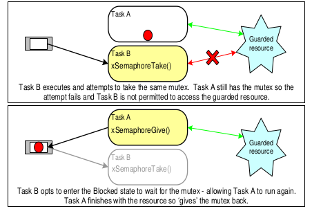
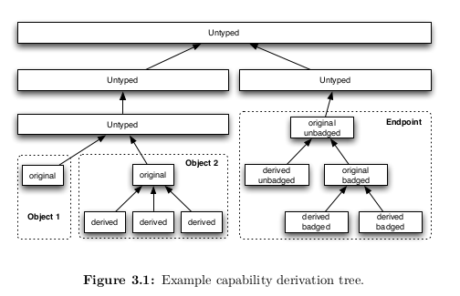
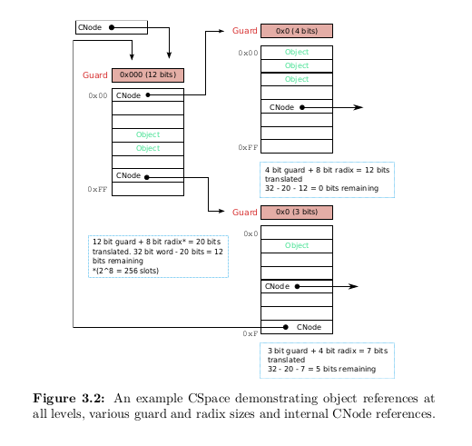
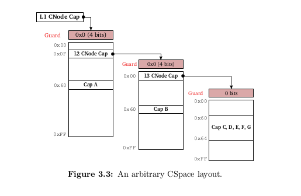

- [ ] tcb_t
- [ ] ksCurThread
- [ ] 指针与TaskHandle的private域冲突问题
- [ ] untyped add to TCB

***

## 6.12

### repr(C)

通过`repr(C)`在C调用Rust的时候实现结构体的数据布局像C一样实现

`repr(u8)`规定了enum的大小固定为u8

***

## 6.5

### Idle Task

Idle task会被其他任务pre-empted，就是其他任务要执行就马上被抢占

pre-emption自动发生，不需要知道被抢占的任务是谁

Idle task还要负责资源的回收，当`TaskDelete()`后，Idle Task负责回收内核资源

Idle Task **Hook**

功能：
1.  执行`low priority, background, continuous processing functionality`
2.  测试可用处理能力
3.  将处理器放在`low power mode`，不过比`tick-less idle mode`效果要相对差一些

对Idle Task **Hook**的限制

1.  Idle Task Hook function不能尝试阻塞或挂起
2.  TaskDelete时必须要合理的时间范围内返回给调用者，然后Idle Task再清理被删除任务的资源


### tcb.c/tcb.rs

先看一下tcb的数据结构与FreeRTOS的差异

在`include/object/structures.h`中
-   `tcbArch`体系结构相关状态
-   `tcbState`线程状态
    -   Inactive
    -   Running
    -   Restart
    -   BlockedOnReceive
    -   BlockedOnReply
    -   BlockedOnNotification
    -   IdleThreadState
-   `tcbBoundNotification`与TCB相连的notification,Notification that this TCB is bound to. If this is set, when this TCB waits on
-   `tcbFault`，当前错误，8字节,tag有
    -   NullFault
    -   CapFault
    -   UnknownSyscall
    -   UserException
    -   VMFault
-   `lookup_fault_t`，查找错误，tag有
    -   invalid_root
    -   missing_capability
    -   depth_mismatch
    -   guard_mismatch
-   `tcbDomain`，域?Domains are used to isolate independent subsystems, so as to limit information flow between them
-   `tcbMCP`，最大可控优先级
-   `tcbPriority`，优先级
-   `tcbTimeSlice`，剩余时间片
-   `tcbFaultHandler`，cap指针，指向线程错误handler
-   `tcbIPCBuffer`用户态的线程IPC buffer虚地址
-   `tcbSchedNext`调度器队列的后指
-   `tcbSchedPrev`调度器队列的前指
-   `tcbEPNext, tcbEPPrev`endpoint, notification队列的后指和前指
-   `tcbName`名字

FreeRTOS中tcb数据结构

-   `state_list_item`
-   `event_list_item`
-   `task_priority`
-   `task_stacksize`
-   `task_name`
-   `stack_pos`
-   `critical_nesting`
-   `base_priority`
-   `mutexes_held`
-   `runtime_counter`
-   `notified_value`
-   `notify_state`
-   `delayed_aborted`

tcb的数据结构为tcb_t，定义在`structure.rs/.c`中

-   `checkPrio`检查优先级是否超过当前线程最大可控优先级
-   `addToBitmap`指定cpu和dom域，指定优先级prio进行相应Bitmap置1
-   `removeFromBitmap`相反，置0
-   `tcbSchedEnqueue`将tcb加入调度ready队列头，可以使用FreeRTOS原来的队列，但是数据结构可能会有相应的调整
-   `tcbSchedAppend`将线程加入ready队列尾
-   `tcbSchedDequeue`将线程ready队列中取出
-   `tcbEPAppend`加入endpoint队列队尾
-   `tcbEPDequeue`从endpoint队列中取出，随机访问双向链表
-   `getExtraCPtr`从IPC buffer最大消息容量+2出取出第i个extraCap
-   `setExtraBadge`将badge写入IPC buffer的第i个extraCaps位置
-   `copyMRs`从一个线程将`msg Registers`拷贝到另外一个寄存器
-   `setMRs_syscall_error`将错误信息写到接受者IPC Buffer消息寄存器

`decodeCopyRegister`会调用`InvokeTCB_CopyRigster`


***

## 6.2

initialise

FreeRTOS在学长的实现中使用的是heap_3.c，heap_3.c主要使用malloc和free进行分配内存，比较容易实现，代价是因为这两个函数比较通用，因此对于专用的系统，开销过大，但是我们应该还是主要采用这种方式

一点思考：主要是在Idle Task上作Untyped Memory的初始化，但是这个Idle Task还是通过Initialise进行初始化，起了个名字叫Idle，所以下一步工作应该是把Initialise进行修改添加Cap支持

不懂的地方：
kernel.rs:175:213   config不太懂，idle_task_fn不知道干什么
task_control:287    handle clone()?，可不可以使用当前handle而不是克隆一个（也许是没有了解清楚）

***
## 5.14

- priority inversion



critical section

```c
void vPortEnterCritical( void )
{
	vPortDisableInterrupts();
	uxCriticalNesting++;
}

void vPortDisableInterrupts( void )
{
	xInterruptsEnabled = pdFALSE;
}

```

`get_handle_from_option`宏从`Option`中获取任务handle，如果参数为None，则返回当前任务的handle，然后对这个handle进行相应的操作


`taskENTER_CRITICAL`, `taskEXIT_CRITICAL`就是进入临界区关中断，开中断

uxCriticalNesting大概就是临界区嵌套深度，只有当临界区深度==0并退出临界区的时候，中断才会重新开始，否则，中断就不会被允许

[uxCriticalNesting相关链接](https://freertos.org/FreeRTOS_Support_Forum_Archive/November_2005/freertos_uxCriticalNesting_1386799.html)

`reset_next_task_unblock_time()`在队列为`delayed take list`为空的时候将`task_global::NEXT_TASK_UNBLOCK_TIME`设为最大值`portMAX_DELAY`，在延迟队列不空的时候获得头结点，`get_list_item_value`就可以获得它的从Blocked State移出的时间

`task_delete()`

删除任务需要进入临界区

idle_task会删除释放被删除任务的内存

1.  在该函数中获取首先handle，如果结果是None，则表示删除自己。
2.  接着是从ready_list, event_list中删除handle
3.  对于删除自己的任务，将其加入`TASKS_WAITING_TERMINATION`队列中，并且通过调用`set_deleted_tasks_waiting_clean_up!`宏将`DELETED_TASKS_WAITING_CLEAN_UP`添加使得idle task能够检查`TERMINATION`队列进行相应操作
4.  对于删除其他任务，首先减少`task_number`，然后获取栈并释放掉，然后要重设下一个任务的unblock time
5.  删除完之后要重新调度，如果删除的是当前任务，还要执行YIELD

`task_suspend()`

`task_issuspended()`判断是否被挂起

`resume_task()`恢复被挂起的任务，如果有`configUSE_PREEMPTION`则执行`YIELD`


***
## 5.9

APIs

```
////  task_queue.rs
将当前的task的event list item按照优先级降序排在相应的event list中
参数：event_list，事件列表,ticks_to_wait让新加的item等一会???
task_place_on_event_list()

将当前的任务拥有的mutex增加
返回：当前任务
task_increment_mutex_held_count()

当mutex holder的优先级小于现在要获得这个mutex的任务的优先级的时候，mutex holder会暂时继承这个要获得任务的优先级，这样可以防止medium优先级任务再次抢占高优先级任务
参数：mutex_holder互斥量拥有者task
task_priority_inherit(mutex_holder)


暂时继承就意味着要回到原来的优先级，即disinherit
返回true表示需要上下文切换。如果没有返回true，即在第一个mutex返回的时候没有进行上下文切换，则在最后一个mutex返回的时候，总会发生上下文切换，无论当前任务是不是在等待
task_priority_disinherit(mutex_holder)

////    task_control.rs
将任务加入等待队列，如果该任务的优先级大于当前最高等待队列最高优先级，则设置等待队列最高优先级(TOP_READY_PRIORITY)为该任务的优先级，并且插入等待队列的最末端
append_task_to_ready_list()

将新任务加入ready list并且将`current_number_of_tasks`加1，然后启用调度器，如果调度器没有正在跑且新任务比原来正在跑的任务优先级大，那么就手动将该新任务变成当前任务
add_new_task_to_ready_list()

current task number与current task的区别
```


***
## 研究seL4
***
4.16

### Threads

MCS configuration | SMP configuration of the kernel

TCB(thread control block)
- CSpace & VSpace(shared with other thread)
- IPC buffer to transfer caps

#### scheduling

-   preemtive, tickless scheduler with 256 priority levels
-   thread's priority
    -   priority
    -   Max controlled priority

#### scheduling contexts

-   (budgets, period) - (b, p)
-   RR scheduling
    -   budget charged each time the current node's scheduling context changed

-   b == p threads are treated as robin threads

passive thread

***
4.14

### Endpoints badges

`mint` operation by the invoker could create a new endpoint object with a badge(tag)

the badge is received by the receiving thread's badge register

### Cap Transfer

the sending thread should have `Grant rights` to copy the capabilities to the receiver

without `Grant rights` results in raw message transfer **without message transfer**

Caps to be sent contained in the sending thread's IPC buffer in the **caps** field. each cap pointed by **CPTR**. number of caps in **extraCaps**

Receiver specifies **receiveCNode**, **receiveIndex**, **receiveDepth** for the slot address to store caps

**unwrapped** a cap refers to endpoint. badge placed into the n-th position of receiver's badges array, kernel sets the n-th bits in the **capsUnwrapped** field. cap not transfered

**not unwrapped** is copyed and the sender retains the cap

### Errors

1.  source cap can not be found(be changed when sending threads are blocked)
2.  destination slot can not be looked up
3.  cap transfered can not be derived

error will not void the entire transfer but end it prematurely

receiver's IPC buffer set to the number of failed transfered caps

no error message returned to receiving thread

### Calling and Replying

`Call`
1.  `Send()`
2.  IPC procedure
3.  **Grant** and **GrantReply** on the invoked endpoint object

not Grant or GrantReply, caller thread suspended

if yes, reply cap set in receivers's TCB and Grant right set. caller wait for reply

invoking **reply** **cap** is not blocking

a reply cap is non-owning, kernel would destroy the cap immediately if reply is impossible

The seL4_Call() operation exists not only for efficiency reasons (combining two operations into a single system call). It differs from seL4_Send() immediately followed by seL4_Recv() in ways that allow certain system setup to work much more efficiently with much less setup that with a traditional setup. **In particular, it is guaranteed that the reply received by the caller comes from the thread that received the call without having to check any kind of badge.**


***
4.12

### Message Passing(IPC)

message: a number of message word and some caps

tranform by `message register`,some are really registers, some stored in `IPC buffer`, which is part of memory.一般先满足寄存器，寄存器不够了再加到IPC buffer上
> 为了效率而这么设计

### EndPoints

使用rendez-vous模型(交汇模型?)，是同步和阻塞的

EndPoints object 会让发送和接收线程进行排队，在没有接受者的时候，Sender就会处于等待队列，反之亦然

Send & Call必须要有Write权限

Send 没有Write权限的错误会被忽略，无法知道send失败是因为权限的缺失

Recv 没有Read权限会引发错误以示与普通消息的区别

***
4.11

`Untyped Memory` object在满足`kernel`的需求后分给`initial thread`，然后完全由之后的线程自己分配使用，可以转换为其他object，另外，内存到底是RAM还是`device memory`会有相应的继承关系以及约束

在`retype untyped memory`时会生成相应的树，通过`seL4_CNode_Revoke()`系统调用将子树上的所有相关capability收回，调用该方法后就没有对函数参数中capability的引用，就可以安全retype了

`Object size`对于`CNode`和`Untyped Memory`是可变的，而对于其他是固定长度的，在libsel4中定义

seL4要求编程者管理所有内核内部的数据结构，要求用户者构建CSpace和定址capability

`access right`
-   Read
-   Write
-   Grant
-   Grant Reply(less powerful form of Grant)

在创建新的CNode的时候，如果要求比源CNode的capability更多的capability，会自动将那些多的capability消除(downgrade)



Deletion and Revocation

`seL4_CNode_Delete()`删除一个cap，在只剩最后一个cap时删除整个CNode，内存会被释放，可以重用

`seL4_CNode_Revoke()`Delete所有CDT children的相应capability，最后一个会有相应的删除object操作

- [ ] Note that for page tables and page directories seL4_CNode_Revoke() will not revoke
frame capabilities mapped into the address space. They will only be unmapped from the space.





CNode需要address与depth limit，也就是它当前所处的位置已经用过的位数

cap不需要

-   Lookup Failure
    -   Invalid root(CPTR root is invalid)
    -   Missing capability(cap not present or not have sufficient rights)
    -   Depth Mismatch()

***

# 调研内容

author: Li Qingwei

## 目录结构

1.  [学长在FreeRTOS的实现，主要通过README，调研报告等的阅读](#x-rust-freertos调研报告)
2.  [FreeRTOS](#freertos)
3.  [对以往组的实现的粗略总结](#往届大作业的实现以及不足)
4.  [已有的一些项目](#已有的一些项目)
5.  [主流操作系统下的ACL, capability](#aclcapability-in-mainstream-operating-systems)

[reference](#reference)


### x-rust-freertos调研报告

感觉文章很多地方像是翻译的，有些地方读起来不是很通顺

1.  背景：用Rust可以让实时操作系统更具可靠性与安全性
2.  立项依据
    1.  嵌入式系统的特点
        1.  发展趋势
        2.  脆弱性
        3.  计算能力有限，易被黑客篡改
        4.  物理暴露导致的非法物理接触设备
        5.  部署环境的特殊性导致难以维护
        6.  网络攻击
        7.  软件层面的攻击(硬件层面由于是OS课没有考虑)
            1.  让安全敏感的程序在虚拟机中跑，但是虚拟机自身的安全没有得到验证
            2.  网络层采用明文传输，密码易被捕获
    2.  Rust优势
        1.  保证使用指针与内存的安全
        2.  异步，无锁，并发
    3.  RTOS现今需求
        1.  资源管理
            1.  RTSJ-Java实时规范，不需要垃圾回收的Java应用的方法，在不受存储器分配的情况下用Java编写实时应用
            2.  及时(in time?)
            3.  Java, C#对just-in-time(JIT)编译器的使用限制，必须使用类似C,C++所用的提前编译器(ahead-of-time)
        2.  安全性需求
            3.  引入分区系统将应用的非实时部分放在这部分采取安全措施的空间
3.  Rust is good
4.  嵌入式系统
    1.  嵌入式操作系统简述
        1.  安全对策
            1.  虚拟化
                1.  操作系统层，建立可信安全实体，隔离用户态进程
                2.  容器移植
                3.  无法保证虚拟化自身的安全
            2.  操作系统层
                1.  利用系统挂钩构建监控模块
                2.  系统策略控制
                3.  无法保证自身安全
            3.  应用层
                1.  比对二进制文件
            4.  网络层
                1.  轻量级加密
                2.  生成类似UUID，以便识别
    2.  Rust优势
        1.  无运行时库,(MUSL,放弃glibc)，没有平台依赖性或运行时依赖性
        2.  运行时损耗，在运行时必须付出的额外代价

### FreeRTOS

根据FreeRTOS官网信息:

RTOS的任务调度器必须提供可预测的执行模式，而且对特定事件要反应非常快

传统的实时任务调度器采用用户为每个执行线程声明优先级的方式进行调度，FreeRTOS中也是(something interesting?不知道有没有更加先进的调度方式)

见[freertos guide](https://www.freertos.org/FreeRTOS-Coding-Standard-and-Style-Guide.html)里的**Developer Docs**，里面还有很多部分是可以进行改写与移植的

### 往届大作业的实现以及不足

据osh2019组的[README](https://github.com/OSH-2019/x-rust-freertos/tree/master/README.md)以及[结题报告](https://github.com/OSH-2019/x-rust-freertos/blob/master/docs/concluding.md)，他们已经实现了Rust改写``task scheduler``,``queue``,``semaphores and mutexes``还有一些可选项(暂时没看)，还有是与C进行交互的FFI

> 但是他们又在结题报告中说已经基本实现了FreeRTOS就很迷惑

不足:

1.  没有消灭全局变量
2.  使用了std库，而没有自己实现
3.  使用了过多的智能指针，基于操作系统信号量机制，容易造成死锁

### 已有的一些项目

[github某库的部分实现](https://github.com/lobaro/FreeRTOS-rust)

从README看到主要是好像主要是一个包装，内部实现还是C，但是各部分之间的连接是用Rust实现的，可以从github的语言成分分析看出来

```
The freertos-rust dependency provides an interface to access all FreeRTOS functionality from your (embedded) Rust app.
```

感觉上并不是操作系统，而是一个处于操作系统与软件之间的一个交互程序

引自[freertos-rust](https://github.com/lobaro/FreeRTOS-rust/tree/master/freertos-rust)
```
Wrapper library to use FreeRTOS API in Rust.
```
### ACL&capability in mainstream Operating Systems

#### ACL definition

Access Control List(ACL)是与系统资源关联的权限列表。ACL指定某些用户或系统进程能够访问某些对象，以及允许对给定对象一些特定操作。

```
典型ACL entry(access control entry, ACE)以如下形式表现

subject---operation
```

Multics是最早提供文件系统ACL的操作系统之一

主要有POSIX ACL, NFSv4 ACL, Active Directory ACLs, Networking ACLs

#### Linux ACL

```
访问控制列表 (ACL) 为文件系统提供了一种附加的、更灵活的权限机制。它的设计目的是帮助 UNIX 文件权限。ACL 允许您将任何用户或组的权限授予任何磁盘资源
```

btrfs, ext2/3/4文件系统默认启用`acl`参数

#### Linux Capability

`Capability`在linux中通过`security namespace`的`extended attribute`实现

[from manual of linux capabilities](https://man.archlinux.org/man/capabilities.7)

implementation
```
A full implementation of capabilities requires that:
1.For all privileged operations, the kernel must check whether the thread has the required capability in its effective set.
2.The kernel must provide system calls allowing a thread's capability sets to be changed and retrieved.
3.The filesystem must support attaching capabilities to an executable file, so that a process gains those capabilities when the file is executed.
```
> since kernel 2.6.24

[notes](https://man.archlinux.org/man/capabilities.7#Notes_to_kernel_developers)
```
When adding a new kernel feature that should be governed by a capability, consider the following points.

The goal of capabilities is divide the power of superuser into pieces.
这样可以减少损失。root权限过大

associating the feature with one of the existing capabilities

(the size of capability set is 64bits)

Don't choose CAP_SYS_ADMIN(similar to a new root)
```

[Thread capability](https://man.archlinux.org/man/capabilities.7#Thread_capability_sets)

[File capability](https://man.archlinux.org/man/capabilities.7#File_capabilities)

#### Why sel4 capability


### reference:

OS相关:

[x-rust-freertos/docs/research.pdf](https://github.com/OSH-2019/x-rust-freertos/tree/master/docs/)

[freertos.rs](https://github.com/hashmismatch/freertos.rs)

[freersos meets Rust](http://www.hashmismatch.net/freertos-meets-rust/)

[freertos](https://www.freertos.org/)

[about-freertos](freertos.org/about-RTOS.html)

[FreeRTOS-rust](https://github.com/lobaro/FreeRTOS-rust)

[Rust RT-Thread-OS FreeRTOS](https://www.seeedstudio.com/blog/2021/02/05/rust-rt-thread-os-freertos-come-to-the-raspberry-pi-pico/)

[Linux ACL](https://wiki.archlinux.org/index.php/Access_Control_Lists_(%E7%AE%80%E4%BD%93%E4%B8%AD%E6%96%87))

[ACL](https://en.wikipedia.org/wiki/Access-control_list)

[Linux capabilities](https://man.archlinux.org/man/capabilities.7)

[linux capability in a easy way](https://linux-audit.com/linux-capabilities-101/#:~:text=Linux%20capabilities%20provide%20a%20subset%20of%20the%20available,is%20reduced%20and%20decreasing%20the%20risks%20of%20exploitation.)

Rust语言学习:
[example](https://doc.rust-lang.org/rust-by-example/hello/comment.html)

张昱老师的一些推荐:

[清华的rCore-OS](https://github.com/chyyuu/os_course_info)

> 大概是用Rust实现操作系统的各个部分

> 里面提到的一些学习Rust的方法可以借鉴一下

顶会的一些文章，探讨Rust与OS相关(我也没怎么看，到时候可以看看)

[](https://link.springer.com/chapter/10.1007/978-3-030-59851-8_22)

[](https://www.usenix.org/conference/osdi20/presentation/narayanan-vikram)

[](https://dl.acm.org/doi/abs/10.1145/3102980.3103006)

[mit os2018](https://pdos.csail.mit.edu/6.828/2018/labguide.html)

