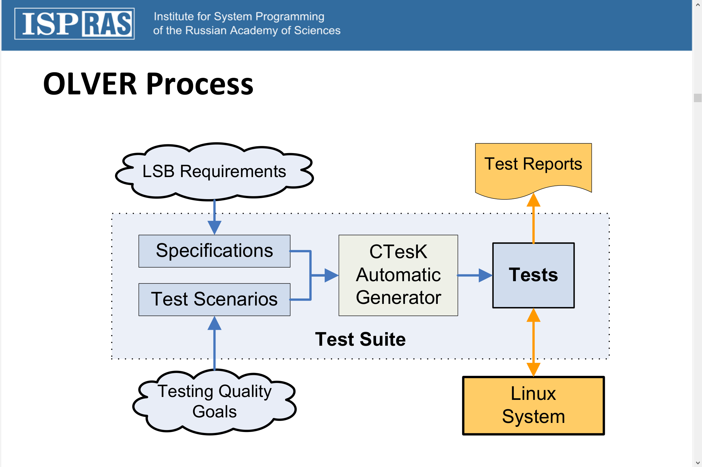

## 3 views on OS :
- OS as API for applications
- OS is an OS kernel
- OS is a part of software/hardware platform （模糊不清，不考虑这个）
## OS Testing/Verification Classification
- Testing (dynamic analysis, monitoring, run-time
verification, fault injection)
- Static analysis (lightweight analysis, software model
checking)
- Static/dynamic analysis (DART, concolic testing)
- Deductive verification(seL4)

## OS as an API
### Problems
- Huge sets of APIs (but not for microkernel)
- Lack of specifications
### Methods
- Traditional (handmade) test suites
- Specification/model based testing
- ``Specification-based testing tools`` (seL4 has a spec (of course!))
- ADLT (Sun Microsystem, 1993)


example (memcpy() specification template)
```c
pre
{
    // If copying takes place between objects that overlap, the behavior is undefined.
    REQ("app.memcpy.02", "Objects are not overlapped", TODO_REQ() );
    return true;
}
post
{
    /*The memcpy() function shall copy n bytes from the object pointed to by s2 into the object pointed to by s1. */
    REQ("memcpy.01", "s1 contain n bytes from s2", TODO_REQ() );
    /* The memcpy() function shall return s1; */
    REQ("memcpy.03", "memcpy() function shall return s1", TODO_REQ() );
    return true;
}

```
## OS is an OS kernel
### Problems
- Event driven multithreading systems
- Lack of specifications (poor quality of specifications, Microsoft Windows is an exclusion)
### Methods
- Runtime verification
- Fault simulation
#### Runtime Verification
运行时验证是一种 计算系统 分析和执行方法，基于从运行的系统中提取信息，并利用它来检测并可能对满足或违反某些属性的观察行为作出反应。一些非常特殊的属性，如数据间隔和死锁自由度，通常希望所有系统都能满足，并且可能最好用算法实现。

e.g. Sanitizer Tools Family in LLVM
- MemorySanitizer: fast detector of uninitialized memory use in C++
- AddressSanitizer: A Fast Address Sanity Checker
- Dynamic Race Detection with LLVM Compiler
- ThreadSanitizer – data race detection
- KernelThreadSanitizer – data races in Linux Kernel

``so much for theoretical stuff``
## seL4 (unit) test

### 根任务
``sel4test-driver``是一个可执行文件，它作为seL4根任务运行。它期望得到一组初始的seL4能力(``seL4_Bootinfo_t``)，并使用它们来引导自己的系统环境，创建测试环境，然后运行所有的测试。它具有基本的操作系统功能，用于创建和销毁多个测试运行和支持不同的测试环境。

## 测试环境
测试环境定义了一个测试在运行时可以访问的资源。一个环境可能有启动和关闭程序，在测试运行之前和之后运行。一个测试定义有一个测试环境属性，用于将一个测试与它所需要的环境联系起来。

## Bootstrap环境
每个测试环境都在一个独立于根任务的 "进程 "中运行测试。这是为了将测试相互隔离。然而有一个引导测试环境，它在根任务中运行测试。这个环境用于运行测试创建和与不同环境 "进程 "通信的功能。

## 测试
测试是一个引用环境的函数。每个测试都会执行一组动作，产生一个结果。测试结果与一个预期值进行比较，以确定成功或失败。一个测试预计会随着成功或失败的结果而终止，不允许永远运行。

## 测试选择
测试的引用被添加到一个特殊的链接器部分，root task在运行时使用这个链接器来选择和运行测试。运行的测试是根据测试是否被启用以及测试名称是否与root task配置的regex匹配来选择的。测试要根据构建时的构建配置自动选择是否启用。regex用于进一步过滤哪些测试被运行。默认的regex是.*，用于选择所有启用的测试。

## 测试运行
测试是按顺序运行的，每次测试运行之间都会重置其测试环境。可以配置root task是在测试失败的条件下停止还是继续运行。测试失败不应该导致整个应用程序崩溃。大多数测试环境并没有强制执行这一点，因为许多测试都是在测试内核机制，可能需要允许它们崩溃系统的权限。需要编写一个测试，使这种结果最小化。

## 报告结果
测试结果是通过测试调用的函数来报告的，这些函数是由一个通用的测试API定义的。root task可以根据其配置选择如何报告测试结果。一些报告格式应该是机器可解析的，以支持测试运行自动化。也应该提供人可读的格式。
# 参考文献
- [Testing and Verification of Operating
Systems and Information Security Issues](http://www-public.imtbs-tsp.eu/~maag/tarot2016/slides/OS-VERIF-ISec-TAROT-Petrenko-AK.pdf)