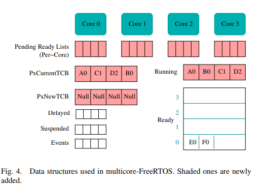
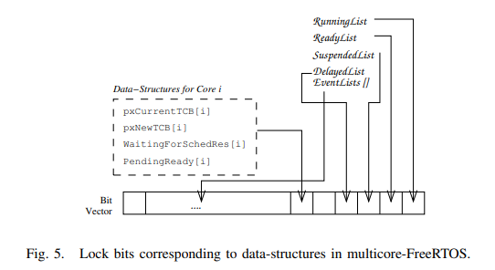

# 可行性报告
- [可行性报告](#可行性报告)
  - [理论依据](#理论依据)
    - [seL4 Capability与FreeRTOS的关系](#sel4-capability与freertos的关系)
      - [CSpace](#cspace)
      - [Message Passing(IPC)](#message-passingipc)
    - [Threads](#threads)
      - [scheduling](#scheduling)
      - [scheduling contexts](#scheduling-contexts)
      - [调度算法](#调度算法)
      - [异常](#异常)
      - [Notification](#notification)
      - [VSpace](#vspace)
      - [Fault](#fault)
        - [Capability Fault](#capability-fault)
        - [未知系统调用](#未知系统调用)
        - [用户异常](#用户异常)
        - [调试](#调试)
        - [Page Fault](#page-fault)
      - [中断](#中断)
      - [I/O](#io)
    - [Rust 语言特性](#rust-语言特性)
      - [内存安全](#内存安全)
      - [Unsafe](#unsafe)
      - [FFI(Foreign Function Interface)](#ffiforeign-function-interface)
      - [条件编译](#条件编译)
    - [Multicore](#multicore)
  - [技术依据](#技术依据)
    - [调试与运行环境](#调试与运行环境)
      - [编译](#编译)
      - [使用qemu仿真](#使用qemu仿真)
      - [开发板环境仿真](#开发板环境仿真)
  - [项目开发路线](#项目开发路线)
    - [step1 rust-FreeRTOS的Rust版本迭代](#step1-rust-freertos的rust版本迭代)
    - [step2 向FreeRTOS加入capability特性](#step2-向freertos加入capability特性)
    - [step3 尝试移植到多核环境](#step3-尝试移植到多核环境)
  - [创新点](#创新点)
  - [参考文献](#参考文献)
## 理论依据
### seL4 Capability与FreeRTOS的关系
[research.md](research.md)中介绍了seL4的kernel object以及capbilities

其中各个object大致对应的FreeRTOS部分为

| seL4 object               | FreeRTOS part      |
| ------------------------- | ------------------ |
| Endpoints & Reply objects | queue&semaphore    |
| Thread Control Block(TCB) | task control block |
| scheduling context        | task schedule      |
| Interrupt object          | queue              |
| Notification              | Notification       |

> 其他如Untyped Memory和CNode为capability机制特有的，或者FreeRTOS不存在这部分，如VSpace

对于FreeRTOS中的TCB，主要涉及数据结构的改写和CSpace, IPC buffer的添加

以下如果没有特殊说明，都是在seL4中的实现

seL4中主要采用线程的概念，与FreeRTOS采用的task类似

#### CSpace

seL4通过在满足`kernel`的内存需求之后，通过`Untyped Memory object`分配给`initial thread`，然后之后的子线程可以通过`retype untyped memory`来实现object类型的转换


`Object size`对于`CNode`和`Untyped Memory`是可变的，而对于其他是固定长度的，在libsel4中定义，也就是说对于大部分object，其占用内存大小都是固定的。对于线程来说，其拥有的内存大小也是固定的，这不同于FreeRTOS的动态分配

下图是object进行分配的示意图


`seL4_CNode_Delete()`删除一个cap，在只剩最后一个cap时删除整个CNode，内存会被释放，可以重用

`seL4_CNode_Revoke()`Delete所有CDT children的相应capability，最后一个会有相应的删除object操作

在FreeRTOS中需要通过单独开辟新的文件进行CSpace数据结构和方法的编写(x-qwq, cspace.rs)

#### Message Passing(IPC)

线程间的消息传递在seL4中主要通过`message register`实现，另外`EndPoints object`类似于管程，通过sender的`Call()`或者`Send()`函数进行消息的发送(更推荐Sender使用`Call()`，因为其中还包含了对cap right的检查)。

此外,`EndPoints`还将对发送者和接受者进行排队。如果没有接收者，发送者就会一直处于等待队列中

`Send`和`Call`必须要有`Write`权限，如果`Send`没有`Write`权限，则发送者无法知道Send失败

`Recv`没有`Read`权限则会引发错误以示与普通消息的区别

`Grant`权限让发送者可以通过`CPTR`和`extraCaps`传递caps，接收者通过`CNode, Index, Depth`来定位存储位置,另外sender有保有对这些caps的访问渠道，可以随时通过`Revoke()`撤回


在调用`Call`的时候，会依次执行`Send`, `IPC procudure`以及对`Grant`和`Grant Reply`的检查，如果没有`Grant`或者`GrantReply`权限，caller将被挂起；如果有，接收者的TCB将会设置`reply cap`和`Grant right`，caller就会等待接受者的reply

reply cap的唤起是非阻塞的，同时它也不归属于谁(或者说可以归属于kernel)，因为有可能caller已经杀死导致回复不可能被接受到

- caps传输错误
1.  source cap can not be found(be changed when sending threads are blocked)
2.  destination slot can not be looked up
3.  cap transfered can not be derived

错误并不会导致整个传输的失败，而是会将在错误发生之前的传输成功，将失败的传输通过`extraCaps`写入接受者的IPC buffer

### Threads

MCS configuration | SMP configuration of the kernel

TCB(thread control block) 
- CSpace & VSpace(shared with other thread)
- IPC buffer to transfer caps

#### scheduling

-   preemtive, tickless scheduler with 256 priority levels
-   thread's priority
    -   priority
    -   Max controlled priority

#### scheduling contexts

-   (budgets, period) - (b, p)
-   RR scheduling
    -   budget charged each time the current node's scheduling context changed

-   b == p threads are treated as robin threads

passive thread没有scheduling contexts


#### 调度算法

只有拥有`active scheduling contexts`的线程才可被调度

#### 异常

分为标准异常和超时异常

标准异常需要`standard exception handler`来处理

超时异常可有可无，超时之后会执行异常处理程序。

#### Notification
``Notification``是一个二进制信号量集，它包含一个``Data Word``。

``seL4_Signal``()方法将所引用通知cap的标记与通知字进行``位或``(OR)，来更新通知信号标识，它还会释放等待通知的第一个线程(如果有的话)。因此，seL4_Signal()的工作方式类似于并发地发送多个信号量(由标识中设置的位表示)。如果信号发送者cap是无标记的或者说标记值是0，该操作将降级为只唤醒等待通知的第一个线程。

``seL4_Wait``()方法的工作原理类似于信号量集上select样式的等待：如果在调用seL4_Wait()时通知字为0，则调用程序将阻塞；否则，调用将立即返回，并将通知字设置为0，获得的通知字值返回给调用者。

``seL4_Poll``()与seL4_Wait()相同，只是如果没有任何信号在等待接收，调用将立即返回，而不会阻塞。

如果在调用seL4_Signal()时有线程正在等待通知信号，则第一个排队的线程将接收到通知，所有其他线程继续等待，直到下一次通知发出。
#### VSpace
seL4中的虚拟地址空间称为 ``VSpace`` 。由微内核提供的对象组成。而这些用于管理虚拟内存的对象在很大程度上与硬件相关。因此，每个体系结构都为VSpace顶级和进一步的中间分页结构定义了自己的对象。每个架构都通用的对象是``Page``，它表示一页物理内存。内核还包括用于跟踪地址空间状态的ASID池和ASID控制对象。

每个体系结构都有一个顶级分页结构(级别0)和一些中间层级。顶级分页结构直接对应于seL4中VSpace的顶级结构概念。对于每一个架构，VSpace被实现为不同的对象，这由架构细节决定。

通常，每一层级的每个分页结构都包含可以映射下一级分页结构或特定大小内存Page的slot。如果上一级结构没有映射，本级的映射操作将失败。需要``手动``创建和映射所有的分页结构。每个层级的结构大小和类型，以及解析该层级的虚拟地址位数由硬件决定。

seL4提供了在这些硬件分页结构上操作的方法，包括映射和缓存操作。映射操作需要引用cap，例如，要将一个层级为1的分页结构映射到一个特定的虚拟地址，要引用相应对象的cap，同时要传递顶层结构参数。

通常，顶级结构没有映射调用，而是用作其他几个与虚拟内存相关的对象调用参数。对于某些架构，可以引用顶级页表进行缓存操作。

Page对象对应于物理内存page，用于在虚拟地址空间中实现虚拟内存页。

Page映射的虚拟地址必须对齐页面大小，并且必须映射到适当的VSpace，以及每个中间分页结构。若要映射页可读，引用的页cap必须具有读权限。要映射页可写，该cap必须具有写权限。

所请求的映射权限由映射函数的类型为 ``seL4_CapRights`` 的参数指定。如果引用的cap没有足够的权限来授权映射，则映射权限``静默``降级。特定的映射权限依赖于体系结构，每个架构至少都定义了page Map、Unmap和GetAddress方法。
#### Fault
线程的操作可能导致错误。错误被传递给线程的错误处理程序，以便它可以采取适当的操作。错误类型在消息标签中的标号字段标识，它是以下类型之一： ``seL4_Fault_CapFault``, ``seL4_Fault_VMFault``, ``seL4_Fault_UnknownSyscall``, ``seL4_Fault_UserException``, ``seL4_Fault_DebugException``, ``seL4_Fault_TimeoutFault`` 或 ``seL4_Fault_NullFault``(表示没有发生错误，这是一条正常的IPC消息)。

错误的传递方式是模拟来自出错线程的Call调用。这意味着要发送错误消息，负责错误处理的端点能力必须具有写权限，并有``Grant``或``GrantReply``权限。如果不是这样，就会发生二次错误(通常情况下线程只是挂起)。
##### Capability Fault
cap错误可能发生在两个地方。首先，当seL4_Call()或seL4_Send()系统调用引用的cap查找失败时(对无效cap调用seL4_NBSend是静默失败)，就会发生cap错误。在这种情况下，发生错误的cap可能是正引用的 cap，也可能是在IPC缓冲区caps字段中传递的额外cap。

其次，当调用seL4_Recv()或seL4_NBRecv()时，引用不存在的cap，引用的不是端点或通知cap，或者是没有接收权限，都会导致发生cap错误。

回复错误IPC消息可以使出错线程重新启动。IPC消息内容下表给出。

含义	|IPC缓冲区位置
---|---
重启动地址|	seL4_CapFault_IP
cap地址	|seL4_CapFault_Addr
是否发生在接收阶段(1是，0否)|	seL4_CapFault_InRecvPhase
查找失败信息描述	|seL4_CapFault_LookupFailureType
##### 未知系统调用
当线程使用seL4未知的``系统调用数``执行系统调用时，会发生此错误。出错线程的寄存器设置被传递给线程的错误处理程序，以便于，如在虚拟化应用场景时模拟一个系统调用。

对错误IPC的响应允许重新启动出错线程和/或修改其寄存器。如果应答的消息``标号``为0，则线程将重新启动。此外，如果消息长度非零，则会更新发生错误的线程寄存器设置。在这种情况下，更新的寄存器数量由消息标签中的length字段标识。
##### 用户异常
用户异常用于分发架构定义的异常。例如，如果用户线程试图将一个数字除以0，则可能发生这样的异常。
##### 调试
调试异常用于向线程传递跟踪和调试相关事件，如：断点、监视点、跟踪事件、指令性能采样事件，等等。内核设置了 ``CONFIG_HARDWARE_DEBUG_API`` 后就可以用上述事件支撑用户空间线程。

内核为用户空间线程提供了硬件单步执行的支持，为此引入了 ``seL4_TCB_ConfigureSingleStepping`` 系统调用。

##### Page Fault
线程可能发生页错误，响应错误IPC可以重启出错线程。IPC消息内容在下表给出。

| 含义 |	IPC缓冲区位置 |
|---   |  ---        |
|重启的程序计数器|	seL4_VMFault_IP|
|导致错误的地址|	seL4_VMFault_SP|
|是否取指令错误(1是，0否)|	seL4_VMFault_PrefetchFault|
|错误状态寄存器(FSR)。依赖于架构的错误原因|	seL4_VMFault_FSR|

#### 中断
中断作为通知信号进行传递。线程可以配置内核在每次某个中断触发时，向特定通知对象发出信号。线程可以通过调用该通知对象上的seL4_Wait()或seL4_Poll()来等待中断的发生。

IRQHandler cap表示线程配置某个中断的cap。他们有三个方法:

- ``seL4_IRQHandler_SetNotification``() 指定当中断发生时内核应该signal()的通知对象。驱动程序可以调用seL4_Wait()或seL4_Poll()在此通知对象上等待中断到来。

- ``seL4_IRQHandler_Ack``() 通知内核用户空间驱动程序已经完成了对中断的处理，然后微内核可以继续向驱动程序发送挂起的中断或新中断。

- ``seL4_IRQHandler_Clear``() 从IRQHandler中注销通知对象。

系统启动时``没有``任何IRQHandler cap，只是在系统初始线程的CSpace包含一个``IRQControl``cap。此cap能为系统中每个可用的中断生成单独的IRQHandler cap。典型地，系统初始线程确定系统中其他组件需要哪些中断，为需要的中断生成IRQHandler cap，然后将其委托给适当的驱动程序。
#### I/O
在x86平台上，seL4允许用户级线程的I/O端口访问。对I/O端口的访问由IOPort cap控制，每个IOPort cap标识了可以访问的端口范围。使用seL4_X86_IOPort_In8()、seL4_X86_IOPort_In16()和seL4_X86_IOPort_In32()方法完成从I/O端口的读取，这些方法允许读取8位、16位和32位的数据。类似地，使用seL4_X86_IOPort_Out8()、seL4_X86_IOPort_Out16()和seL4_X86_IOPort_Out32()方法完成向I/O端口的写入。这些方法使用一个IOPort cap和一个无符号整数作为参数，整数表示要读写的I/O端口。在每种情况下，端口号都必须位于给定IOPort cap所标识的I/O端口范围之内。

如果失败，I/O端口方法将返回错误代码。 ``seL4_IllegalOperation`` 表示端口号超出了IOPort cap允许的范围。由于读取I/O端口需要返回两个值 — 读到的值和错误码 — 因此这些API调用返回的是一个包含两个成员result和error的结构。

在系统初始化时，初始线程的CSpace包含了IOPortControl cap，可用于seL4_X86_IOPort_Issue()分配I/O端口范围。分配的范围不能与任何现有IOPort cap的端口范围重叠。

### Rust 语言特性
#### 内存安全
大多数安全语言通过使用GC来确定何时可以安全释放内存来实现内存安全。而Rust则通过使用所有权的概念来避免运行时开销，Rust中的每个值都有一个唯一的所有者--也就是它所绑定的变量。当一个值的所有者超出范围时，这个值就会被释放。

因为只能有一个所有者，所以不允许使用别名。取而代之的是，值要么被复制(with copy trait)，要么在变量之间移动。一旦一个值被移动，它就不能再从原来的变量绑定中访问。

为了简化编程，Rust 允许对一个值的引用，称为 borrow，而不会使原始变量无效。
#### Unsafe
Rust在安全代码和unsafe代码之间有明确的区分，safe代码可以通过某些方式绕过类型系统，而unsafe代码则严格地绑定在类型系统中。具体来说，safe代码可以使用包裹在unsafe中的块来执行不安全操作(例如，解引用一个原始指针)或调用其他不安全函数。

unsafe关键字可以以两种方式使用。首先，任何代码块都可以被包裹在一个不安全块中，以允许它执行可能破坏类型系统的操作。例如，一个硬件抽象层可以使用这个特性将一个内存映射的I/O寄存器作为一个普通的Rust结构暴露出来。
```rust
let mydevice : &mut IORegs = unsafe {
  &mut *(0x200103F as *mut IORegs)
}
```
其次，函数可以被注解为unsafe，以防止不受信任的代码调用它们。例如，标准库的transmute函数可以把它的输入投射到任何其他相同大小的类型中。
```rust
pub unsafe fn transmute<T,U>(e: T) -> U
```
#### FFI(Foreign Function Interface)
FFI是外语言函数接口的简称。就像它的名字一样，FFI用于在一个程序语言的函数中调用另一个语言的函数。这一功能保障了不同程序语言之间能够自由地交互，从而可以把不同语言的代码像积木一样搭建起大型程序。

粗略地说，Rust语言提供了 ``extern`` 关键字，用来标识相关的函数能够用于同其他语言进行交互。当我们需要把Rust函数拿给C程序使用的时候，可以在函数定义前面加上extern "C"，并使用#[no_mangle]标识来保证编译器不会修改函数的名字。示例的代码如下：
```rust
fn main() {
  #[no_mangle]
  pub extern "C" fn call_rust() {
    println!("Just called a Rust function from C!");
  }
}
```
而如果要把C程序拿给Rust使用，我们需要用extern "C"标识出一个块，在块内给出C函数的声明；由于C语言对代码的限制很少，不像Rust为了保证程序的安全性而做出了很多限制，直接调用C函数可能会扰乱Rust的这些限制。因此，Rust规定，调用C函数时必须在unsafe块中进行。示例的代码如下：
```rust
extern "C" {
  fn abs(input: i32) -> i32;
}

fn main() {
  unsafe {
      println!("Absolute value of -3 according to C: {}", abs(-3));
  }
}
```
#### 条件编译
在FreeRTOS的FreeRTOSConfig.h和seL4的libsel4中，有很多用于配置的预定义。在主程序代码中，这些配置选项广泛地被用于条件编译。Rust通过 ``cfg`` 属性，也对条件编译提供了支持。

在代码中，可以采用cfg属性修饰函数：
```rust
// This function is only included when compiling for a unixish OS with a 32-bit architecture
#[cfg(all(unix, target_pointer_width = "32"))]
fn on_32bit_unix() {
  // ...
}
```
### Multicore
为了使FreeRTOS支持多核，我们打算将优先级最高的n个任务安排到一个n核的symmetric multiprocessor上。为此我们需要重新设计和修改FreeRTOS的可移植层，添加新的数据结构，如“运行队列”，并且使用锁的位向量来提供对内核数据结构的互斥访问，最大限度地实现任务之间的解耦，进而可以支持多核处理器。参考文章给出了ARM cortexa9四核处理器的端口特定层的实现，该层利用处理器的加载链接和存储条件（LL/SC）指令来实现锁，并指出可移植层的实现只涉及1400行新代码，确保FreeRTOS继续具有较小的代码占用，由此我们认为将FreeRTOS扩展到支持多核是具有其可行性的。扩展的主要部分包括：
1. 数据结构
我们尽可能地使用已有的数据结构，FreeRTOS使用以下关键数据结构来维护任务信息：
- 就绪队列：FIFO列表
- 延迟队列
- 中断队列（suspended list）和删除列表
- 待处理就绪队列
- 事件队列：等待事件的任务的优先级队列，如消息队列中的消息到达。
- pxCurrentTCB：指向当前正在执行的任务的指针。
但我们还需要一些数据结构。因为有多个正在运行的任务，所以我们维护一个包含正在运行的任务的运行列表。此列表按优先级的递增顺序维护，在此范围内，按运行时间的递减顺序维护。


2. 运用锁实现对内核数据结构的互斥访问
我们实现了一种基于位向量的锁定机制，以控制对内核数据结构的访问。内核数据结构，如运行列表、就绪列表、延迟列表等，在向量中被分配指定的位，如图5所示。其他特定于核心的资源，如pending ready list、pxCurrentTCB和pxNewTCB，都受到core-id上的锁的保护。这些锁是通过原子地修改这个位向量来获得和释放的。使用字长的位向量允许在单个CPU加载/存储指令中寻址整个向量。这样就可以在一瞬间检查向量并获取所有必要的锁，从而消除了等待等待的情况。
TODO

3. 调用调度程序
在FreeRTOS中，调度程序通常作为每个API调用的一部分运行，也作为tick中断的ISR的一部分运行。在多核FreeRTOS中，调度采用两种不同的方法：Schedule和FullReschedule。前者用于调度一个新启用的任务，以取代优先级最低的运行任务。后者是调度例程，在所有内核上调度下一轮可运行任务。
• Schedule is invoked, whenever a task is unblocked by the availability of the resource it was blocked on, or by an explicit task resume. Also, when a running taskis suspended or deleted, we invoke Schedule to run the next top-priority longest waiting ready task.
• FullReschedule is invoked by the tick ISR which resides on core 0. In the case that the task executing in core 0 has locked core 0,   the ISR will increment uxPendedTicks by 1 and exit. The FullReschedule will be invoked either by the tick ISR next time (if core 0 doesn’t hold its core lock) or by an API call, whichever happens first. This approach makes sure that a tick is never lost.

## 技术依据
### 调试与运行环境
QEMU可以模拟多种多核处理器，因此我们可以方便地在QEMU上运行改造后的FreeRTOS，以测试其性能。

环境采用目前工业主流的stm32板块
#### 编译
+ 安装对应三元组配置
  ```bash
  rustup target add thumbv7m-none-eabi
  ```
+ 编译生成ELF文件
  ```bash
  cargo build --target=thumbv7m-none-eabi
  ```
+ binutils 工具集
为了查看和分析生成的可执行文件，我们首先需要安装一套名为 binutils 的命令行工具集，其中包含了 objdump、objcopy 等常用工具。

Rust 社区提供了一个 cargo-binutils 项目，可以帮助我们方便地调用 Rust 内置的 LLVM binutils。我们用以下命令安装它

```bash
cargo install cargo-binutils

rustup component add llvm-tools-preview
```
+ 通过 objcopy 转换为二进制文件
  生成的文件为ELF格式， 为能够加载到内存中实现，需要利用objcopy转换
```bash
objcopy -O binary os os.bin
```

#### 使用qemu仿真
此处参考了GitHub上一个项目[**FreeRTOS-GCC-ARM926ejs**](https://github.com/jkovacic/FreeRTOS-GCC-ARM926ejs)
使用
```bash
qemu-system-arm -M versatilepb -nographic -m 128 -kernel image.bin
```
即可进行仿真测试
#### 开发板环境仿真
此处则是需要利用`STM32Cube`生成芯片上的环境
STM32Cube可以生成所选芯片的MakeFile，在本地`make`后，利用工具链`arm-none-gcc`
```bash
arm-none-eabi-objcopy -O binary -S build/for_stm32f429.elf build/for_stm32f429.bin
``` 
之后使用`qemu-system-gnuarmeclipse`可以运行出结果

## 项目开发路线
### step1 rust-FreeRTOS的Rust版本迭代
+ 参照现有的rust-FreeRTOS代码与最新的FreeRTOSc源码，重写v10.4版本的FreeRTOS
+ 分析新增的Notification与StreamBuffer模块，加入新的模块

### step2 向FreeRTOS加入capability特性
+ 分析sel4中capability的实现，将capability的实现加入step1所写的内核中。如果可以，希望在不损失效率的前提下，模块化地实现

### step3 尝试移植到多核环境
+ 学习SMP，实现多核的移植，如果可以，也希望不损失效率的前提下，模块化地实现
+ 鉴于调研到的内容比较多，考虑到可行性，多核的移植我们仅作为最深的目标，尽量完成
## 创新点
TODO
## 参考文献
- [A Multi-Core Version of FreeRTOS Verified for Datarace and Deadlock Freedom](https://dl.acm.org/doi/abs/10.1002/spe.2188)
- [μc/OSII扩展到多核](https://kns.cnki.net/kcms/detail/detail.aspx?dbcode=CMFD&dbname=CMFD2012&filename=1011292401.nh&v=QzVMjO8gx9HNLh3IotQypnFPpd9WDV5fxMZBcaZ3bpzlWfQZBJJTvqLrpbCEPZ4H)
- [Ownership is Theft: Experiences Building an Embedded OS in Rust](https://www.tockos.org/assets/papers/tock-plos2015.pdf)
- [OS in Rust](https://www.infoq.com/presentations/os-rust/)
- [seL4 manual](https://sel4.systems/Info/Docs/seL4-manual-latest.pdf)