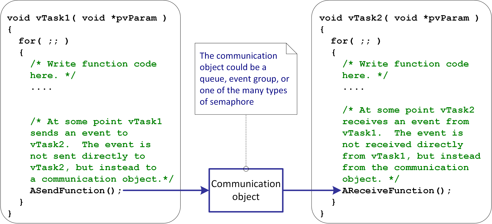
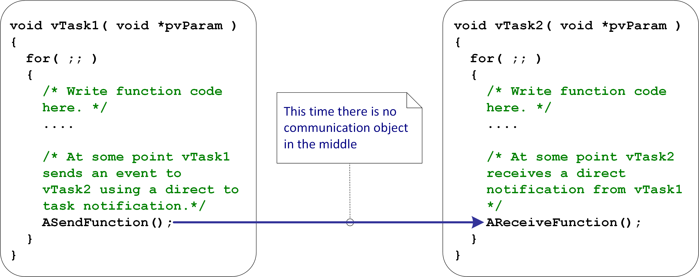
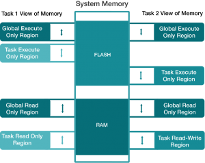

# 调研报告
## 报告目录
- [调研报告](#调研报告)
  - [报告目录](#报告目录)
  - [项目成员](#项目成员)
  - [项目简介](#项目简介)
  - [项目背景](#项目背景)
    - [FreeRTOS可改进之处](#freertos可改进之处)
      - [内存安全](#内存安全)
      - [FreeRTOS没有安全模型](#freertos没有安全模型)
      - [多核拓展](#多核拓展)
    - [seL4](#sel4)
      - [seL4's capability](#sel4s-capability)
      - [seL4 IPC](#sel4-ipc)
      - [ACL](#acl)
      - [Confused Deputy Problem](#confused-deputy-problem)
        - [Linux ACL & Linux Capability](#linux-acl--linux-capability)
    - [实时操作系统](#实时操作系统)
    - [嵌入式操作系统](#嵌入式操作系统)
    - [多处理器](#多处理器)
      - [多任务](#多任务)
      - [调度](#调度)
      - [多核处理器](#多核处理器)
      - [多核处理器的调度算法](#多核处理器的调度算法)
    - [FreeRTOS](#freertos)
      - [FreeRTOS的库](#freertos的库)
        - [Message Buffers](#message-buffers)
        - [Task Notifications](#task-notifications)
      - [FreeRTOS安全性调研](#freertos安全性调研)
    - [Rust语言特性](#rust语言特性)
      - [C语言及其他高级语言](#c语言及其他高级语言)
      - [Rust](#rust)
        - [内存安全和线程安全](#内存安全和线程安全)
        - [Rust的并发风格](#rust的并发风格)
  - [立项依据](#立项依据)
    - [capability机制的引入](#capability机制的引入)
    - [multicore](#multicore)
    - [版本迭代](#版本迭代)
  - [前瞻性/重要性分析](#前瞻性重要性分析)
  - [相关工作(科研与工业界)](#相关工作科研与工业界)
    - [学术界](#学术界)
      - [多核实时操作系统](#多核实时操作系统)
      - [顶会对使用Rust编写OS的讨论](#顶会对使用rust编写os的讨论)
      - [seL4](#sel4-1)
    - [工业界](#工业界)
      - [FreeRTOS内存安全方面的实现](#freertos内存安全方面的实现)
  - [参考文献](#参考文献)
## 项目成员
  * 李清伟
  * 陈文杰
  * 胡冰
  * 徐昊
  * 张栋澈
## 项目简介

本项目以 ``FreeRTOS`` 为重点，主要完成以下4项内容：将seL4的 ``capability`` 机制添加到 FreeRTOS 中，以及使用 ``Rust`` 语言改写FreeRTOS来提高FreeRTOS的安全性，进行FreeRTOS的Rust版本迭代，将FreeRTOS移植到树莓派上运行，通过可加载模块实现FreeRTOS在多核处理器上运行。


## 项目背景
### FreeRTOS可改进之处
#### 内存安全
TODO

#### FreeRTOS没有安全模型
TODO

由于``FreeRTOS``的
#### 多核拓展
TODO

### seL4

seL4是一种高安全性，高性能的操作系统微内核。它是唯一的，因为它进行了全面的正式验证，且不会影响性能。它旨在用作构建安全性和安全性关键的系统的可信赖基础。

作为内核意味着它是运行在任何软件系统的核心并控制对资源的所有访问。它通过Capability提供细粒度的访问控制，并控制系统组件之间的通信。它是软件系统中最关键的部分，并以特权模式运行。

作为微内核seL4要被缩小为与策略(policy)无关的最小内核，因此可以为构建为许多不同使用场景提供服务的任意系统提供可靠的基础。

seL4是L4微内核家族的成员，并且是世界上最先进，最有保证的操作系统内核。

seL4的正式验证使它与任何其他操作系统都脱颖而出。简而言之，它为系统中运行的应用程序之间的隔离提供了最高的保证，这意味着可以遏制系统某一部分的妥协，并防止损害系统中其他可能更关键的部分。

具体来说，seL4的实现已在形式上（数学上）相对于其规范得到了正确的证明（无错误），并被证明具有强大的安全性，并且，如果配置正确，其操作在最坏情况下的执行时间也已被证明是安全的上限。它是世界上第一个具有这种证明的操作系统，并且仍然是唯一经过验证的，具有基于细粒度功能的安全性和高性能的操作系统。它还对混合关键性实时系统提供了最先进的支持。

#### seL4's capability
Capability(以下简称cap)是用于提供访问系统中对象权限的凭证。seL4系统中所有资源的cap在启动时都被授予根进程。要对任何资源进行操作，用户都需使用libsel4中的内核API，并提供相应的cap。

cap是seL4 kernel object的不可变引用，cap还对访问权限进行编码，事实上，cap是对对象的引用和它传递给该对象的权限的封装。

正是这种细颗粒度(fine-grained)、面向对象的性质，使得cap成为面向安全系统的首选访问控制机制。按照principle of least privilege的要求，可以将赋予一个组件的权利限制在其完成工作所需的绝对最低限度。

一共有十种内核对象，它们为：
- ``Endpoints``和``Reply Objects`` :用于收发IPC消息（等下介绍）
- ``Address Spaces``: page table的抽象层
- ``Cnodes``: CSlot的数组（大小为``1u << seL4_SlotBits``），CSlot可以是
  - empty, 含有一个空cap
  - full, 含有一个内核资源的引用
- ``Thread Control Blocks``: 正在执行的线程，包含以下数据
  * 优先级 (0-255)
  * 寄存器状态和浮点数环境
  * CSpace cap
  * VSpace cap (与虚拟内存有关)
  * Endpoint cap (用于发送错误信息)
  * Reply cap

  调度方法 : Round Robin, seL4使用基于优先级的循环调度器。调度器会找出优先级最大的未被阻塞的线程来执行。若有多个优先级相同的进程，将会以先到先得的顺序顺次执行。为了提供确定性的调度，可以将使用域调度。域调度是非抢占式的，线程可以与域关联，这样这些线程只有当此域是活跃时会被调度，而跨域IPC只有当域切换时才会执行。
- ``Scheduling Contexts``: 访问核心上一定的执行时间的权限
- ``Notifications``: 用于同步，与信号量类似
- ``Frames``: 可以被映射到Address Spaces的物理内存
- ``Interrupt objects``: 中断处理
- ``Untypeds``: 除了内核拥有的少量固定大小的内存，所有物理内存都在用户空间被管理。seL4内核空间外的所有物理内存资源的capability都被转移给根进程。这种capability被称为untyped内存。untyped内存是一块特定大小的连续的物理内存，可能为设备内存或RAM内存，两者在赋予类型时有区别。

#### seL4 IPC
进程间通信(IPC)是微内核机制，用于在进程间同步传输少量的``数据``和``cap``。在seL4中，IPC由``Endpoint``来推动，这些端点作为一般的通信端口。对``Endpoint``的调用用于发送和接收IPC消息。
TCB可以发送和接受消息，有``seL4_Send``, ``seL4_NBSend``, ``seL4_Recv``, ``seL4_NBRecv``分别代表阻塞和非阻塞IPC

Reply capability接收端的TCB中。使用``seL4_Reply``来调用该cap，which向客户端发送一个IPC。

每个线程都有一个IPC缓冲区，它包含IPC消息的有效载荷，由数据和cap组成。
#### ACL
Access Control List(ACL)是与系统资源关联的权限列表。ACL指定某些用户或系统进程能够访问某些对象，以及允许对给定对象一些特定操作。ACL的主要缺点是不可以有效迅速地枚举一个对象的访问权限。因此，要确定一个对象的所有访问权限需要搜索整个访问控制表来找出相对应的访问权限。

#### Confused Deputy Problem
类 unix 系统使用``环境权限``(ambient authority)来确定访问权限，例如有一个恶意用户想要通过gcc改变密码文件，他可以使用如下命令
```
gcc -o /path/to/your/passwd main.c
```
来hack电脑，当编译器打开其输出文件进行写入时，操作系统通过查看编译器的主体ID来确定访问的有效性，以确定它是否对对象有访问权。由编译器来判断操作是否有效，使得编译器成为系统TCB的一部分，也就是说OS必须完全信任它，在任何情况下都要做正确的事情。

一个操作的有效性是由代理(gcc)的安全状态决定的 在这种情况下，代理(gcc)是代表原始代理(hacker)操作的副手。为了保证适当的安全性，访问必须由hacker的安全状态决定。这意味着denomination(对文件的引用)和authority(对文件进行操作的权利)必须耦合，这个原则叫做``无指定无授权``。如果是这样，那么编译器就会用指定（来自hacker）带来的权限来调用指定对象(passwd)，hacker就不能再迷惑副手了。
```
典型ACL entry(access control entry, ACE)以如下形式表现

subject---operation
```
Multics是最早提供文件系统ACL的操作系统之一

主要有POSIX ACL， NFSv4 ACL, Active Directory ACLs, Networking ACLs
##### Linux ACL & Linux Capability

`Capability`在Linux中通过`security namespace`的`extended attribute`实现，而且是可加载模块

而在seL4中，capability贯穿于整个系统

linux的ACL机制与sel4的capability的安全机制，二者对比如下：
* sel4's capability:
  - object-oriented对象优先
  - fine-grained
  - 系统干预access
  - 授权模式，用户之间的授权可随时通过摧毁capability以取消授权
* Linux's access control:
  - subject-oriented主体优先(rwx)
  - coarse-grained
  - confused deputy
### 实时操作系统
大多数操作系统似乎允许多个程序同时执行。这称为多任务处理。实际上，每个处理器内核只能在任何给定的时间点运行单个执行线程。操作系统的一部分称为调度程序，负责确定何时运行哪个程序，并通过在每个程序之间快速切换来提供同时执行的错觉。

操作系统的类型由调度程序决定何时运行哪个程序来定义。例如，在多用户操作系统（例如Unix）中使用的调度程序将确保每个用户获得相当数量的处理时间。作为另一个示例，桌面操作系统（例如Windows）中的调度程序将尝试确保计算机保持对用户的响应。

实时操作系统（RTOS）的任务调度器必须提供可预测的执行模式，而且对特定事件要反应非常快，故RTOS中的调度程序旨在提供可预测的（通常描述为确定性的）执行模式。由于嵌入式系统通常具有实时要求，因此嵌入式系统尤其需要注意这一点。实时要求是一种要求嵌入式系统必须在严格定义的时间（最后期限）内响应特定事件的要求。只有在可以预测操作系统调度程序的行为（因此是确定性的）的情况下，才能保证满足实时要求。

传统的实时调度程序（例如FreeRTOS中使用的调度程序）通过允许用户为每个执行线程分配优先级来实现确定性。然后，调度程序使用优先级来知道接下来要运行哪个执行线程。在FreeRTOS中，执行线程称为任务。

**RTOS可划分为3个不同的领域：**
  * 系统级：指RTOS运行在1个小型的计算机系统中完成实时的控制作用。这个领域将主要是微软与Sun竞争之地，传统上Unix在这里占有绝对优势。Sun通过收购，让他的Solaris与 Chrous os（原欧洲的1种RTOS）结合，微软力推NT的嵌入式版本"Embedded NT"。此外，嵌入式Linux将依托源程序码开放和软件资源丰富的优势，进入系统级RTOS的市场。

  * 板级：传统的RTOS的主要市场。如Vxwork, PSOS, QNX, Lynx和VRTX的应用将主要集中在航空航天、电话电讯等设备上。

  * SOC级（即片上系统）：新一代RTOS的领域，主要应用在消费电子、互联网络和手持设备等产品上。代表的产品有Symbian 的Epoc、ATI 的Nucleus, Express logic 的Threadx。老牌的RTOS厂家的产品VRTX和Vxwork 也很注意这个市场。

从某种程度讲，不会出现1个标准的RTOS（像微软的Windows在桌面系统中的地位一样），因为嵌入式应用本身就极具多样性。在某个时间段以及某种行业，会出现1种绝对领导地位的RTOS，比如今天在宽带的数据通信设备中的Vxwork和在亚洲手持设备市场上的WinCE就是一例子。但是，这种垄断地位也并不是牢不可破的，因为在某种程度上用户和合作伙伴更愿意去培养1个新的竞争对手。比如，Intel投资的Montivista和Motorola投资的Lineo，这两家嵌入式Linux系统，就是说明半导体厂商更愿意看到1个经济适用的、开放的RTOS环境。
### 嵌入式操作系统
+ 按相应时间分
> 按照系统对响应时间的敏感程度，EOS可以分为实时操作系统（RTOS）和非实时操作系统两大类。
> RTOS对响应时间有非常严格的要求。但某个外部时间或请求发生时，相应的任务必须在规定的时间内完成相应的处理。RTOS可以分为硬实时和软实时两种情形。
> + 硬实时系统   硬实时系统对响应时间有严格的要求，如果响应时间不能满足，可能会引起系统的奔溃或致命错误。
> + 软实时系统   软实时系统对响应的时间也有要求，如果响应的时间不能满足，将需要支付能够接收的额外代价。
+ 按软件结构分
> 按照软件结构化分，EOS可以分为单体结构、分层结构和微内核结构3大类。
> + 单体结构：
> 
> 嵌入式Linux操作系统、Jbed RTOS、和PDOS都属于单体内核结构。在单体结构的操作系统中，中间件和设备驱动程序通常集成在系统内核当中，整个系统通常只有一个可执行文件，里面包含了所有的功能组件。单体结构的操作系统由一组功能模块组成，系统各个模块之间可以相互调用，通信开销比较小，系统高度集成和相互关联，系统裁剪、修改、调试和维护不便。
>+ 分层结构
>采用分层结构的操作系统内部分为若干层次（0~N），各个层次之间的调用关系是单向的，即某一层次上的代码只能调用比它低层的代码。分层结构要求在每层次上都要提供一组API接口，增加了系统的额外开销，单系统的开发和维护较为简单。典型代表有MS-DOS，其结构就是一个有代表性的、组织良好的分层结构。
>+ 微内核结构
>微内核（microkernel）结构把操作系统的大部分功能都剥离出去，在内核中保留最核心的功能单元（如进程管理和存储管理），大部分的系统功能都位于内核之外，例如，将所有的设备驱动程序都置于内核之外。
>

### 多处理器
#### 多任务
传统处理器一次只能执行一个任务-但是通过在任务之间快速切换，多任务操作系统可以使其看起来好像每个任务都在同时执行。下图描述了这三个任务相对于时间的执行模式。任务名称用颜色编码并写在左侧。时间从左向右移动，彩色线显示在任何特定时间正在执行的任务。上面的图展示了感知到的并发执行模式，下面的图展示了实际的多任务执行模式。

#### 调度
实时操作系统（RTOSes）使用这些相同的原理实现多任务处理-但是它们的目标与非实时系统的目标有很大不同。不同的目标反映在调度策略中。实时/嵌入式系统旨在提供对现实事件的及时响应。现实世界中发生的事件可以有一个截止时间，在这个截止时间之前，实时/嵌入式系统必须做出响应，并且RTOS调度策略必须确保这些截止时间得到满足。

为了实现此目标，软件工程师必须首先为每个任务分配优先级。然后，RTOS的调度策略是简单地确保能够执行的最高优先级任务是给定处理时间的任务。如果它们准备同时运行，则可能需要在优先级相同的任务之间“公平地”共享处理时间。
#### 多核处理器
将实时操作系统扩展到多核需要考虑以下问题：
* 不同核的启动顺序问题
* 多核的同步和互斥问题
* 多核的任务调度算法
* 内核的移植算法

#### 多核处理器的调度算法
多处理器系统的任务调度算法非常关键。然而多处理器调度的难点是如何确定任务分配给哪个核及任务分配给对应的核后如何执行，这是一个 NP 完全问题。如果任务为周期性任务，则相对比较好解决。如果任务为一般任务，则相对复杂。多处理器调度算法的设计要点主要有以下三点：
* 如何把任务分配给不同的核，有两种方式可供选择：静态分配策略，即一个任务永久分配给同一个核；动态分配策略，所有核共用一个就绪列表，当某个核空闲时，选择一个就绪任务运行。
* 是否支持多道程序设计，即在计算机内存中同时存放几道相互独立的程序，使它们在管理程序控制之下相互穿插的运行。对于小型的嵌入式系统的应用相对比较简单，一般不需要采用多道程序设计。
* 实际指派任务的方式。
  > 对多核处理器的任务调度的研究很多，比较常用的有时间片轮转调度法和单处理器扩展后的调度算法。
  - 时间片轮转调度法：每次调度时，总是选择就绪队列的队首进程，让其在CPU上运行一个系统预先设置好的时间片。一个时间片内没有完成运行的进程，返回到绪队列末尾重新排队，等待下一次调度。
  - 单处理器扩展后的调度法：在单处理器中比较常见的 FCFS（先来先服务）算法、SJF（短作业优先）算法和 EDF（最早截止期优先）算法等。如果将其运用于小型的嵌入式多核操作系统是比较好的，其算法简单，修改起来比较方便，因此得到广泛应用。实验证明处理器的数目增多会导致复杂调度算法的有效性逐渐降低，因此大多数采用动态分配策略的多核系统的调度算法往往采用简单的单处理扩展后的调度方法，就绪任务组成一个或者多个按优先级大小排列的队列。

### FreeRTOS
FreeRTOS是一类RTOS，其大小设计得足以在微控制器上运行-尽管它的使用不仅限于微控制器应用。

微控制器是一种受资源限制的小型处理器，在单个芯片上集成了处理器本身，只读存储器（ROM或闪存）以保存要执行的程序以及程序所需要的随机存取存储器（RAM）执行。通常，该程序直接从只读存储器执行。

单片机用于深度嵌入的应用程序（那些您从未真正看到过处理器本身或正在运行的软件的应用程序）中，这些应用程序通常具有非常专门的工作。大小限制和专用的最终应用程序性质很少保证使用完整的RTOS实现-或确实使使用完整的RTOS实现成为可能。因此，FreeRTOS仅提供核心的实时调度功能，任务间通信，定时和同步原语。这意味着它可以更准确地描述为实时内核或实时执行程序。然后，附加组件可以包含其他功能，例如命令控制台界面或网络堆栈。
#### FreeRTOS的库
针对新版本中FreeRTOS增加的其中两个库 ``Message Buffer`` 和 ``Task Notification``，本项目着重对这两个库用rust语言改写。
##### Message Buffers
流缓冲区是RTOS任务到RTOS任务的中断，是对任务通信原语的中断。与大多数其他FreeRTOS通信原语不同，它们针对单读取器单写入器场景进行了优化，例如将数据从中断服务例程传递到任务，或从一个微控制器内核传递到双核CPU上的另一个内核。数据通过复制传递-发送者将数据复制到缓冲区中，并通过读取将其复制到缓冲区之外。

流缓冲区传递连续的字节流。消息缓冲区传递可变大小但不连续的消息。消息缓冲区使用流缓冲区进行数据传输。

FreeRTOS消息缓冲区和流缓冲区提供了为队列提供更小，更快的替代方案。

流缓冲区允许将字节流从中断服务例程传递到任务，或从一个任务传递到另一任务。字节流可以具有任意长度，并且不一定具有开头或结尾。可以一次写入任意数量的字节，并且可以一次读取任意数量的字节。数据通过复制传递-发送者将数据复制到缓冲区中，并通过读取将其复制到缓冲区之外。与大多数其他FreeRTOS通信原语不同，流缓冲区针对单读取器单写入器场景进行了优化，例如将数据从中断服务例程传递到任务，或从一个微控制器内核传递到双核CPU上的另一个。

消息缓冲区允许将可变长度的离散消息从中断服务例程传递到任务，或从一个任务传递到另一任务。例如，长度为10、20和123字节的消息都可以写入和读取同一消息缓冲区。与使用流缓冲区不同，10字节消息只能作为10字节消息而不是单个字节读出。消息缓冲区建立在流缓冲区之上（也就是说，它们使用流缓冲区实现）。数据通过复制传递到消息缓冲区中-发送方将数据复制到缓冲区中，并通过读取将数据复制出缓冲区。

如果在任务使用``xMessageBufferReceive()``从碰巧为空的消息缓冲区中读取时指定了非零的阻止时间，则该任务将被置于“阻止”状态（因此，它不会消耗任何CPU时间，并且其他任务可以运行）直到消息缓冲区中的数据可用或阻止时间到期为止。

如果在任务使用``xMessageBufferSend()``写入恰好已满的消息缓冲区时指定了非零的阻止时间，则该任务将被置于“阻止”状态（因此它不会消耗任何CPU时间，其他任务也可以运行）直到消息缓冲区中的任何空间变为可用，或者阻止时间到期为止。
##### Task Notifications
大多数任务间通信方法都通过中介对象，例如队列，信号量或事件组。发送任务写入通信对象，接收任务从通信对象读取。顾名思义，当使用直接任务通知时，发送任务将通知直接发送给接收任务，而无需中间对象。

从FreeRTOS V10.4.0开始，每个任务都有一系列通知。在此之前，每个任务都有一个通知。每个通知都包含一个32位值和一个布尔状态，它们一起仅消耗5个字节的RAM。

正如任务可以阻止二进制信号量以等待该信号量变为“可用”一样，任务可以阻止通知以等待该通知的状态变为“待处理”。同样，就像任务可以阻止计数信号量以等待该信号量的计数变为非零一样，任务可以阻止通知以等待该通知的值变为非零。下面的第一个示例演示了这种情况。



#### FreeRTOS安全性调研
+ FreeRTOS自身没有针对安全性有专门的设计。其本身并未获得安全性认证，不过其另一个付费版本SafeRTOS获得了许多安全性认证。
+ 目前可以调研到的FreeRTOS采用的安全性设计主要是通过加载支持ARM架构下Cortex-M内核的MPU接口实现对内存的保护
### Rust语言特性
#### C语言及其他高级语言
目前流行的实用操作系统，如Windows，Linux，macOS等，主要使用C语言编写。C语言伴随Unix操作系统而生，具有高效、简洁、可移植性强等特点。

C出现的时间较早，当时网络攻击还不是利用相关的威胁模型，大多数早期软件开发人员也没有考虑到相关的安全问题，所以C允许程序员完全控制管理应用程序的内存指针，出现基本的内存管理错误时，也没有相关的提示或者警告，C语言会因为程序员疏忽导致的错误操作，如空指针、野指针、重复释放、越界访问数据竞争等，造成严重的內存安全问题。微软和Google代码库中使用的主要编程语言是C和C++。2020年，Google工程师统计了2015年以来，Chrome稳定分支中修复级别为"high"或"critical"的912个安全错误，结果发现约70%是内存安全漏洞。微软工程师也曾公开表示：在过去12年中，微软产品的安全更新中，约有70%也是在解决内存安全漏洞。

其次，C语言的语言特性匮乏，从现代编程语言的角度看，它仅支持简单的过程式编程，抽象和表达能力不足，如缺少面向对象和接口的语言级支持、缺少必要的标准库基础设施、缺少模块和包管理机制，编译配置复杂等。

更高层的编程语言如C++，采用RAII（Resource Acquisition is Initialization 资源获取即初始化）惯用法实现半自动的内存管理方式，每个变量在超出范围后都一定会被释放，同时C++具有更丰富的语言特性和极强的零开销抽象能力。但性能相比C有所降低，且语言特性过于繁杂，潜在的问题很多，不是经验丰富的开发人员很难驾驭的了。

和Rust同时期诞生的由Google推出的Go语言，其核心特性是名为goroutine的用户协程机制，可以轻松地支持并发编程。Go是一门带有垃圾回收的语言，其它特性类似增强版的C语言。Go诞生后也被用来编写操作系统，但是它的垃圾回收和goroutine带有不小的语言运行时。据2018年MIT公布的Biscuit项目论文，Go相比C语言性能下降10%左右。

#### Rust
为了解决系统软件开发的种种问题，Mozilla研究院于2010年推出了Rust语言，Rust语言于2015年发布了第一个稳定版本。作为一门注重性能的系统级编程语言，Rust最早被Graydon Hoare设计时，计划用于取代C/C++，该语言最初的设计目标是提供与C/C++同样的性能，但允许更多编译时的安全检查以及少量的运行时检查。

Rust使用ownership和borrowing来实现它的两个关键特性：没有垃圾回收的内存安全、没有数据竞争的并发。
##### 内存安全和线程安全
Rust语言的主要特性是引入了所有权、生命周期和借用机制，从而在编译期进行内存安全检查，避免出现空指针、野指针、悬空指针。针对多线程的数据竞争问题，Rust为对象引入了Send和Sync标记，限制它们是否允许跨线程传递和多线程访问，实现了线程安全。

Rust继承并发扬了C++语言中的RAII模式，引入了所有权（ownership）的概念，并在此基础上建立了引用（reference）和借用（borrow）规则。此外，每个所有者变量和引用变量都有自己的生命周期（lifetime）。引用变量的生命周期不能超过其引用目标，这样就避免了悬空引用。所有权和借用机制有所有权规则和引用规则，这两个机制解决了单线程环境下的内存安全问题。但到了多线程中，需要对共享变量增加更多的约束，以防止数据竞争。Rust 语言引入了两个标记特性(marker trait)：Send和Sync。

 同时，由于过多的语法限制可能对于用Rust实现很多底层操作造成阻碍，Rust使用了unsafe语法来帮助开发者更灵活地绕过一些编译期的检查，获得与C同样灵活的内存操作能力，同时需要开发者自行承担相应的风险。

内存安全和线程安全，是操作系统内核的核心诉求。随着单核处理器逐渐达到技术瓶颈，现代CPU正在向多核发展，相比毫无安全保护的C语言，Rust语言有着天然的优势。

##### Rust的并发风格
* channel只传送属于其的消息，程序员能从一个线程发送指针到另外一个线程，而不用担心这两个线程因为同时访问这个指针产生竞争争夺，Rust的channel通道是线程隔离的。
* lock知道其保护数据，当一个锁被一个线程hold住，Rust确保数据只能被这个线程访问，状态从来不会意外地被分享，锁住数据，而不是代码是Rust的特点。
* 每个数据类型都能知晓其是否可以在多线程之间安全传输或访问，Rust增强这种安全用涂; 也就没有数据访问争夺，即使对于无锁的数据结构，线程安全不只是文档上写写，而是实在的法律规则。
* 程序员能在线程之间分享stack，frames，Rust会确保这个frame在其他线程还在使用它时一直活跃，Rust会在共享时确保安全。
Rust的并发模型保证了编译器阻止了所有的数据竞争。

## 立项依据

### capability机制的引入

现有的FreeRTOS kernel主要强调的是如何把内核做的小，做的节能，还有做的快，但是并没有强调进程或线程，内存，文件等访问权限的安全性，并且加之嵌入式设备逐步连入网络的趋势，安全性问题亟待解决，因此我们就考虑引入capability机制来保证安全性

### multicore
（为什么要多核处理器？）
早期的嵌入式应用由于嵌入式处理器运算能力低,所以功能单一,主要使用死循环代码实现。随着大规模集成电路技术的发展和摩尔定律(Moore Law)的驱使,嵌入式处理器的性能越来越强,如今已经可匹敌桌面电脑。现在的嵌入式应用已经十分复杂,往往一个嵌入式应用需要集成数个功能,这种多任务环境的嵌入式应用已经离不开嵌入式操作系统的支持。针对特定的实时性要求严格的应用场景,比如工业控制、军事武器,更需要嵌入式实时操作系统的支持。当通过提升过主频来提升处理器性能达到瓶颈时,多核技术的出现解决了单核芯片的性能瓶颈,使得处理性能的提升有了新的发展方向。多核的技术思想是：将两个或者多个独立的核封装到一个芯片内部，由多个核并行地计算。通过这样做，不仅获得较高处理器性能，还可以将处理器主频保持在较低的水平，因此支持多核的实时操作系统有广阔的应用前景。

### 版本迭代

19级已有用rust改写FreeRTOS的项目`rust-freertos`。经过调研，其改写的是FreeRTOSv9.0。而9.0发行于2016年，到现在也经历了五年的发展。现在的FreeRTOS已经更新到v10.4版本。对于包括任务间的通信在内的实现有了较大的改进


## 前瞻性/重要性分析
随着计算机技术的发展，嵌入式实时系统在众多领域得到广泛应用。相比于单核处理器，多核处理器能够使嵌入式系统获得更高的性能。

Rust引入了独特的语言机制，可以在编译期进行内存安全检查，突破性地解决了系统软件中的内存安全问题。同时它还具有现代语言中常见的编程范式。是编写操作系统的良好工具。

互联网日益普及，缺乏良好的安全机制无疑是操作系统的一大弊端，sel4的capability机制有一定的优越性，且sel4和FreeRTOS较为相似，将sel4的capability机制添加到FreeRTOS是有意义的。

## 相关工作(科研与工业界)
### 学术界
#### 多核实时操作系统
南京航空航天大学的王凯等人对μcos这一嵌入式操作系统进行了扩展，基于Linux对多核的支持方式，对不同核的启动顺序、多核的同步和互斥、多核的调度算法、及移植到多核处理器几个方面进行了扩展，并将其移植到NiosII多核处理器上进行试验，成功地使μcos从只支持单核处理器扩展到支持多核处理器。
#### 顶会对使用Rust编写OS的讨论
加利福尼亚大学使用Rust语言开发了RedLeaf操作系统，旨在探索语言安全对操作系统组织的影响。它不依赖于硬件地址空间进行隔离，只使用Rust语言的类型和内存安全。并基于RedLeaf隔离机制，演示了实现端到端零复制、故障隔离和设备驱动程序透明恢复的可能性。

Stefan Lankes,Jonathan Klimt,Jens Breitbart,Simon Pickartz等人研究了用于开发可伸缩、虚拟执行环境的编程语言Rust，并提出了将基于Rust的IP堆栈集成到RustyHermit中。RustyHermit是标准Rust工具链的一部分，普通的Rust应用程序能够构建在RustyHermit之上。

清华大学王润基使用Rust从零开始实现了一个完整的小型操作系统项目rCore，通过实践检验了Rust语言操作系统的可行性、可用性和优越性，全面分析了在编写操作系统过程中，Rust语言的能力和潜力。

清华大学潘庆霖使用Rust设计开发了zCore操作系统，在经历了几个月的迭代开发之后，zCore操作系统内核已经能够支撑像shell这样的用户态程序完整运行，并且在性能上缩小了与 Zircon 内核的差距。
#### seL4
seL4由澳大利亚CSIRO的Trustworthy Systems小组研发并经过形式化验证，是世界上第一个完整的通用操作系统内核的功能正确性的形式化证明，以及内核二进制是C实现的正确翻译的证明。

### 工业界

#### FreeRTOS内存安全方面的实现

我们目前的个人电脑主要通过Memory Management Unit将每个应用程序沙箱化来保护内存

在嵌入式设备中，Memory Protection Unit(MPU)提供相同的功能

MPU通常允许程序以特权或非特权模式运行，并使用一组“区域”来确定当前执行的代码是否具有访问代码和数据的权限。每个区域都是一个连续的内存块，具有该内存的一组权限；特权和非特权访问。与非特权代码的子集相比，特权代码往往可以访问大部分（即使不是全部）设备内存

在应用程序的整个运行时中，这些区域不必相同。MPU区域可以根据每个任务进行修改；每个任务可以具有自己独特的区域集，这些区域在任务移至运行状态时进行配置。这使用户可以仅对需要代码和数据的任务授予访问权限。利用MPU的嵌入式操作系统将在每次上下文切换期间管理每个任务的区域和特权级别。

下图显示了两个不同的任务在使用MPU的情况下访问内存的的情形。这里总共有两个全局区域，一个从FLASH开始，另一个从RAM开始。任务1被授予权限访问FLASH中的一些代码，任务2就不能访问，如果任务2想要访问任务1的授权代码，MPU fault就会被产生

MPU对于开发人员而言，最大的好处就是能够在开发早期发现错误。尽早发现错误可以大大减少开发时间。在项目后期修复代码中的错误可以减少文档和测试代码中所需的返工。另一方面，及早修复错误将减少项目后期阶段代码中存在的错误数量。这将简化识别和修复其余bug的过程，因为一次出现多个bug的可能性较小。

MPU如何实现这一目标？最明显的方法是保护与当前执行的代码不相关的所有数据。可以仅使用两个RTOS任务A和B来构造一个简单的示例。任务A和B不应相互交互，但是存在一个错误，任务A可能会意外写入任务B偶尔使用的某些数据。覆盖此数据不会影响任务A的正确操作。但是，当任务B尝试使用损坏的数据时，可能会发生错误。如果没有MPU，这个bug就很难被发现，在B很少使用这些损坏的数据时就更难发现，而有了MPU，这种错误的写操作在执行的时候就会马上造成异常方便debug




## 参考文献
1.  seL4 capability
  - [seL4 Whitepaper](https://sel4.systems/About/seL4-whitepaper.pdf)
  - [CNode](https://docs.sel4.systems/Tutorials/capabilities.html)
  - [TCB](https://docs.sel4.systems/Tutorials/threads.html)
  - [IPC](https://docs.sel4.systems/Tutorials/ipc.html)
  - [Confused Deputy](http://en.wikipedia.org/wiki/Confused_deputy_problem)
  - [ACL](https://en.wikipedia.org/wiki/Access-control_list)
  - [Linux capabilities](https://man.archlinux.org/man/capabilities.7)
2. FreeRTOS
  - [FreeRTOS官方文档](https://www.freertos.org/)
  - [FreeRTOS内核github仓库](https://github.com/FreeRTOS/FreeRTOS-Kernel)
3. 多核处理器
  - [Adapting FreeRTOS for multicores: an experience report](https://dl.acm.org/doi/10.1002/spe.2188)
  - [多核嵌入式操作系统](https://kns.cnki.net/kcms/detail/detail.aspx?dbcode=CMFD&dbname=CMFD2012&filename=1011292401.nh&v=QzVMjO8gx9HNLh3IotQypnFPpd9WDV5fxMZBcaZ3bpzlWfQZBJJTvqLrpbCEPZ4H)
  - 基于多核的嵌入式操作系统的研究和设计.王凯.南京航空航天大学
  - [多核平台下QNX调度机制](https://kns.cnki.net/kcms/detail/detail.aspx?dbcode=CMFD&dbname=CMFD201302&filename=1013249329.nh&v=quETlUPC1v16GIcJM1Kf9iivPGS8RyKO3m06BM9HiY6Xh2GZVBBZBJ4CTlptXS0i)
  - [多核嵌入式实时操作系统测试方法](https://kns.cnki.net/KXReader/Detail?TIMESTAMP=637534191326044922&DBCODE=CJFD&TABLEName=CJFDLAST2017&FileName=SZJT201702116&RESULT=1&SIGN=r8FNi8N2L4alm7VSj8HANbdQHB4%3d)
4. Rust is Good
  - [Rust语言操作系统的设计与实现](https://github.com/rcore-os/zCore/wiki/files/wrj-thesis.pdf)
  - [zCore操作系统内核的设计与实现](https://github.com/rcore-os/zCore/wiki/files/pql-thesis.pdf)
  - [之前小组的freertos调研报告](https://github.com/OSH-2019/x-rust-freertos/tree/master/docs/)
  - [RustyHermit: A Scalable, Rust-Based Virtual Execution Environment](https://link.springer.com/chapter/10.1007/978-3-030-59851-8_22)
  - [RedLeaf: Isolation and Communication in a Safe Operating System](https://www.usenix.org/conference/osdi20/presentation/narayanan-vikram)
  - [System Programming in Rust: Beyond Safety](https://dl.acm.org/doi/abs/10.1145/3102980.3103006)
