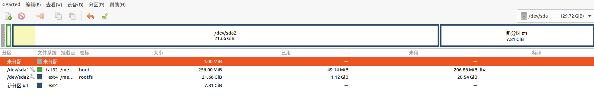

# RE：从零开始的Ceph树莓派部署（Ceph-deploy）
咳咳，写一下文章以记录本人完成实验过程，有一说一网上的大部分ceph文章过时的有些过于严重，许多错误信息导致本人走了许多弯路，希望这篇文章能帮助到正在学习的各位，第一次写博客，如有问题欢迎指正与讨论。

*（PS：官方中文文档很久很久很久没有更新了，有很多东西过期了，而且不知道是不是翻译的，很多时候不说人话，大坑！！！）*

实验文档地址：[OSH-2021](https://github.com/OSH-2021/osh-2021.github.io/tree/main/lab-4)

## 环境介绍
+ 树莓派3B+(搭载raspiOS，[官方下载](https://www.raspberrypi.org/software/operating-systems/))
+ PC(搭载Ubuntu20.04，其实如果有显示屏，可以直接把显示屏接在树莓派上操作，此次限于设备不足，选择用电脑ssh连接树莓派)

## Ceph 简介
随着信息技术的快速发展，互联网产生和处理的数据量迅猛增长。有研究表明，过去两年里产生的数据已经占世界数据总量的 90%。如何存储这些数据是存储系统相关研究的核心问题。传统上的集中式存储系统采用计算能力和 I/O 能力强悍的大型主机进行数据存储，然而目前在数据中心中存储的数据均为 PB 量级甚至更高，传统的集中式存储由于过高的设计和维护成本渐渐难以满足日益增长的存储需求。在目前的数据中心中，普遍采用大量的性价比更高的小型主机，通过分布式文件系统协同存储数据中心中的海量数据，常见的有 Hadoop 分布式文件系统(Hadoop Distributed File System，即 HDFS)和 Ceph 分布式文件系统等

一个典型的部署架构如下

图片上可以看到有四个节点，实际上只有三类节点分别为admin，monitor，osd. （吐槽一下，官方中文文档这边的描述真的很乱）

### admin节点
首先说明一下，这个并不是ceph集群的节点，而是ceph-deploy部署所需要的一个节点，实际上之后存储集群没啥他的事情，他在部署过程中，主要是将ceph装至各个节点上，这个节点可以放在个人pc上也可以放在树莓派上，其实没什么影响。

### monitor节点
这个是ceph集群中的监控节点，负责收集整个集群状态信息，修复集群故障，管理 Cluster Map，与客户端交互等任务。一个集群拥有一个 Monitor 也可运行，但可能会出现单点故障问题，所以为提高可靠性和可用性一般使用多个 Monitor（官方推荐 3 个），Monitor 之间通过 Paxos 算法保持一致性。monitor 通过 MON 守护进程提供服务。

### osd节点
OSD（Object Storage Device）是 Ceph 中负责、读写数据的逻辑存储节点，负责在平面命名空间（flatnamespace，区别于目录层次结构）以对象形式存储所有数据。客户端从 Monitor 处得到 map 信息后就只需和相应 OSD 交互以完成读写请求，而无需和中心节点交互，从而提高可靠性并有效利用系统带宽。OSD 和 Monitor 之间通过心跳机制（而不是通过 Monitor 轮询）向 Monitor 通知例如扩容时有新的 OSD 加入，OSD 自身或者其他 OSD 出现故障，Monitor 根据上报信息修改 Cluster 一个集群拥有一个 Monitor 也可运行，但可能会出现单点故障问题，所以为提高可靠性和可用性一般使用 多个 Monitor（官方推荐 3 个），Monitor 之间通过 Paxos 算法保持一致性。 Cluster Map 更新后不会立即直接广播到所有 OSD，而是在 OSD 主动上报信息时将更新信息回复给对方。OSD 之间进行通信时，如果发现对方的 Cluster Map 版本信息较低，则将更新信息发送给对方

## 部署说明
### 单节点部署
本文章从零开始，尽量做到详细，下面这部分预处理如果已经做好了，可略过，不过要格外小心磁盘分区的事情，否则容易一切木大。
### 树莓派预处理
安装系统方法很多，可以先在[树莓派官网](https://www.raspberrypi.org/software/operating-systems/)上先将系统映像下载下来（如果慢可以用一些国内的下载工具，Windows可以试试迅雷，Linux可以找找其他下载工具），再用烧录工具写入SD卡。

或者直接下载[官方工具](https://www.raspberrypi.org/software/)，它支持工具内链下载OS并且烧录，也支持用户自己的系统烧录（比较推荐这样做）


烧录好后先不急着上板，需要对网络与磁盘分区进行处理。

如果有线，直接插网线即可

如果无线需要如下操作
> 重新将插拔读卡器
> 对于RaspiOS，将在/root/下创建一个空文件叫"ssh"(注意：无后缀，小写)。再创建一个文件叫"wpa_supplicant.conf"，写入如下内容（将其中的WIFI名字和WIFI密码换成自己的）
```
country=CN
ctrl_interface=DIR=/var/run/wpa_supplicant GROUP=netdev
update_config=1
 
network={
ssid="WIFI名字"
psk="WIFI密码"
key_mgmt=WPA-PSK
priority=1
}

```
> Ubuntu server请参考[这里](https://ubuntu.com/tutorials/how-to-install-ubuntu-on-your-raspberry-pi#3-wifi-or-ethernet)，其他发行版，请自行查阅

**接下来这步骤很重要~~（磁盘没分区，亲人两行泪）~~**

还是在将卡插入树莓派前

主机端下载一个gparted工具

```
sudo apt install gparted
```

分配完如下  


之后将sd卡插入，树莓派上电即可

如果没有屏幕，我们需要ssh连接树莓派，此时需要知道树莓派的IP地址，在主机上输入
```
ssh pi@树莓派IP
```
然后敲个yes，输入树莓派密码：raspberry

之后便连接成功了。

预处理的最后一步就是对与新系统，换个源
```
sudo vi /etc/apt/source.list
```
将里面的内容删掉换成国内的源（此处用的是科大的源）
```
deb http://mirrors.ustc.edu.cn/raspbian/raspbian/ buster main contrib non-free rpi
```

保存，运行
```
sudo apt update
```

预装lvm2
```
sudo apt-get install lvm2
```

### 安装ceph-deploy

我们需要先加载对应的源

运行
```
wget -q -O- 'https://download.ceph.com/keys/release.asc' | sudo apt-key add -
echo deb https://download.ceph.com/debian-{ceph-stable-release}/ $(lsb_release -sc) main | sudo tee /etc/apt/sources.list.d/ceph.list
```
其中的 {ceph-stable-release}需要换成下载的版本代号，目前是pacific,所以就是
```
wget -q -O- 'https://download.ceph.com/keys/release.asc' | sudo apt-key add -
echo deb https://download.ceph.com/debian-pacific/ $(lsb_release -sc) main | sudo tee /etc/apt/sources.list.d/ceph.list
```

然后安装
```
sudo apt update
sudo apt install ceph-deploy
```

### 安装monitor

先设置Host

**注意**，下面的<hostname>都要替换为pi机的hostname，一般为raspberrypi，具体看bash提示符的user@hostname这里可以看出来，或者自行搜索hostname查看方法，如需更改hostname，如下操作即可
```
hostnamectl set-hostname <新的hostname>
```

回到正题，运行
```
sudo vim /etc/hosts
```

在最下方添加一行内容
```
192.168.xx.xxx(刚刚上面提到的树莓派IP地址)      <hostname>
```

然后自行找一个文件夹，**之后我们所有的指令都必须在这个文件夹下操作**，否则会报错

本人是新建了一个名为ceph_single的文件夹
```
mkdir ceph_single
cd ceph_single
```
然后在文件夹内
```
ceph-deploy new <hostname>
ceph-deploy install --release luminous <hostname>
```

此时ceph已经装到我们的树莓派了

之后我们需要建立monitor节点，单机部署其实不用讲究，之后我们的集群部署，接下来的指令应该要在对应的机子上执行。
```
ceph-deploy mon create-initial
ceph-deploy admin <hostname>
```
*注意：这里可能会有很多报错，可以参考[这篇博客](https://blog.csdn.net/weixin_43357497/article/details/113763295)*

运行
```
sudo ceph -s
```
可以看到此时集群的情况
```
  cluster:
    id:     ac0021de-c857-4175-b283-2fa9
    health: HEALTH_OK
 
 
  services:
    mon: 1 daemons, quorum <hostname>
    mgr: no daemons active
    osd: 0 osds: 0 up, 0 in
 
  data:
    pools:   0 pools, 0 pgs
    objects: 0 objects, 0B
    usage:   0B used, 0B / 0B avail
    pgs:     
```
说明monitor安装成功

接着安装一个重要的组件ceph manager
```
ceph-deploy mgr create <hostname>
```

### 安装OSD

然后，我们开始安装osd，不过先说明一下，安装需要树莓派有空白分区作为存储单元

~~可以利用fdisk，parted等工具将当前树莓派磁盘进行分区，不过对这里相关知识不熟悉可能出问题，网上的教程也并不完善，笔者好几次分区后重新开机异常。所以需谨慎。~~

（补）上面一段有巨大问题，用fdisk等工具直接对当下文件目录分盘，有点像等于在Windows下开机状态格式化C盘，必然出错。正确分区方式在本文树莓派预处理阶段已介绍，如有需要请移步。

或者可以拿个U盘格式化一下，也可以当一个独立的分区。

开始安装OSD，下面的存储介质挂载地址对应我们分割后磁盘的地址或者U盘的挂载地址，可以直接运行 `sudo fdisk -l` 指令查看
```
ceph-deploy osd create --bluestore <hostname> --data <存储介质挂载地址>
```

这时，我们的OSD节点就成功安装了。

到这里，我们的ceph框架就大功告成了。

### Ceph dashboard
这个是一个可以图形化监控整个集群的工具

运行
```
sudo ceph mgr module enable dashboard
 
sudo ceph mgr services
```
应该可以看到以下结果
```
{
    "dashboard": "http://raspberrypi:7000/"
}
```
记住那个端口号7000，这时候进入浏览器输入以下地址（7000替换成自己的端口号）
```
<树莓派ip>:7000
```
就可以看到（图片仅供参考）


### 多节点部署

这里我们用三个树莓派搭建三节点的ceph存储系统

首先通过ssh连接到admin树莓派(admin节点指定为node1,这里可以随意指定，自己记住就行)

#### SD卡分区

同单节点，详见单节点部署树莓派预处理部分

#### 配置源

对每个节点配置源

```
sudo sed -i 's|raspbian.raspberrypi.org|mirrors.ustc.edu.cn/raspbian|g' /etc/apt/sources.list
```

下载`openssh-server`,`ntp`,`vim`等必要软件

#### 统一hostname

#####  修改`hostname`

```
sudo vim /etc/hostname
```

将原本的`raspberrypi`改为`node1`

对于其他树莓派也是类似操作，分别修改为`node2`,`node3`等

##### 修改hosts

对于admin节点，修改`/etc/hosts`文件

在`/etc/hosts`中加入，同时还要将`loopback`的那一行删去
```
<ip> node1
<ip> node2
<ip> node3
```

> 这里`node1`,`node2`就是修改之后的`hostname`，ip对应每个节点的ip，注意不要对应错误

对于其他节点(node2, node3...)

找到`127.0.0.1 raspberrypi`做相应修改
```
127.0.0.1 node<x>(原本为raspberrypi)
```

#### 创建统一用户test并赋予sudo权限

在每个节点创建`test`用户

```
ssh pi@node{x}
sudo useradd -d /home/test -m test
sudo passwd test
echo "test ALL = (root) NOPASSWD:ALL" | sudo tee /etc/sudoers.d/test
sudo chmod 0440 /etc/sudoers.d/test 
```

> 上面代码块中的后面两步让test用户拥有sudo权限

以test用户登录在管理节点(admin)生成ssh key

```
ssh test@{admin-node}
ssh-keygen
```

然后拷贝到各节点

```
ssh-copy-id test@node1
ssh-copy-id test@node2
ssh-copy-id test@node3
```

然后节点之间可以相互ping一下，保证网络通畅

#### 部署

选择node1为admin,node2为monitor,node3为osd(admin之前已经选择了)

在node1节点

```
mkdir my_cluster
cd my_cluster
```

在以下步骤中若遇到麻烦，一定要执行下面两种操作

```
ceph-deploy purgedata node1 node2 ...
ceph-deploy forgetkeys
```

> 上面为purge数据，忘记钥匙

```
ceph-deploy purge node1 node2 ...
```
> 上面会把安装好的ceph-common等也卸载掉，尽量少用

##### 指定node2为monitor(mon)

然后创建monitor(mon)

```
ceph-deploy new node2
```

现在，node2就是monitor了

##### 修改ceph.conf，进行简化版配置

然后还是在node1(admin)上将`ceph.conf`文件修改(该文件在`my-cluster`文件夹下)

加入

```
osd pool default size = 2
public network = {ip-address}/{netmask}(一般为node1 ip/24)
```

##### 在各节点安装ceph

然后运行如下指令在各节点安装ceph

```
ceph-deploy install node1 node2 node3
```

##### 初始化monitor

然后还是在node1节点初始化monitor

```
ceph-deploy mon create-initial
```

创建完之后在`my-cluster`文件夹下应该有`ceph.client.admin.keyring`,`ceph.bootstrap-osd.keyring`,`ceph.bootstrap-mds.keyring`,`ceph.bootstrap-rgw.keyring`

##### 添加osd

然后是添加osd，这里我们在node1, node3下创建

```
ssh test@node1
ceph-deploy osd create --bluestore node1 --data /dev/mm...(空余的那个分区)
```

node3类似

这样就成功创建osd了

##### 收集密钥

这里还是在node1下

```
ceph-deploy admin node1 node1 node2 node3
sudo chmod +r /etc/ceph/ceph.client.admin.keyring
```

##### Ceph Dashboard

同单节点


## 单节点测试
以下仅为简单测试，利用ceph自带的rados bench进行测试

首先我们需要在集群中建立一个pool，运行

```
ceph osd pool create {pool-name} [{pg-num} [{pgp-num}]] [replicated] [crush-rule-name] [expected-num-objects]
ceph osd pool create {pool-name} [{pg-num} [{pgp-num}]]   erasure  [erasure-code-profile] [crush-rule-name] [expected_num_objects] [--autoscale-mode=<on,off,warn>]
```
>pool_name：存储池名
>
>pg-num：PG数, 默认8
>
>pgp-num：PG组数， 以上两个参数详见这里
>
>replicated|erasure：设置存储池对应数据是冗余存储（replicated）还是无冗余（erasure），默认replicated
>
>crush-rule-name：我们用户自定义crush rule路径，默认使用default rule
>
>erasure-code-profile=profile ：仅用于erasure池，规定了纠删码配置
>
>--autoscale-mode=<on,off,warn>：设置是否允许自动调整PG数量， on——允许，off——拒绝，warn——先告知

例如我们这么创建一个PG数为32，名为test的池
```
sudo ceph osd pool create test 32
```

之后我们开始利用rados bench进行测试
```
rados bench -p <pool_name> <seconds> <write|seq|rand> -b <block size> -t --no-cleanup
```
>pool_name：测试所针对的存储池
>
>seconds：测试所持续的秒数
>
><write|seq|rand>：操作模式，write：写，seq：顺序读；rand：随机读
>
>-b：block size，即块大小，默认为 4M
>
>-t：读/写线程数，默认为 16
>
>--no-cleanup 表示测试完成后不删除测试用数据。在做读测试之前，需要使用该参数来运行一遍写测试来产生测试数据，在全部测试结束后可以运行 rados -p <pool_name> cleanup 来清理所有测试数据。

例如我们进行一个10s的写测试，单块大小4M
```
rados bench -p test 10 write -b 4M --no-cleanup
```

得到


测试就算完成了。

补充一下如果要删除某个pool(用<poolname>代指其名)，首先要在/etc/ceph/ceph.conf 目录下最后面加上这样一部分内容
```
[mon]
mon allow pool delete = true
```

之后重启monitor进程
```
systemctl restart ceph-mon.target
```

之后就可以执行删除操作(poolname需要重复输入)
```
ceph osd pool delete <poolname> <poolname> –yes-i-really-really-mean-it
```

就可以了